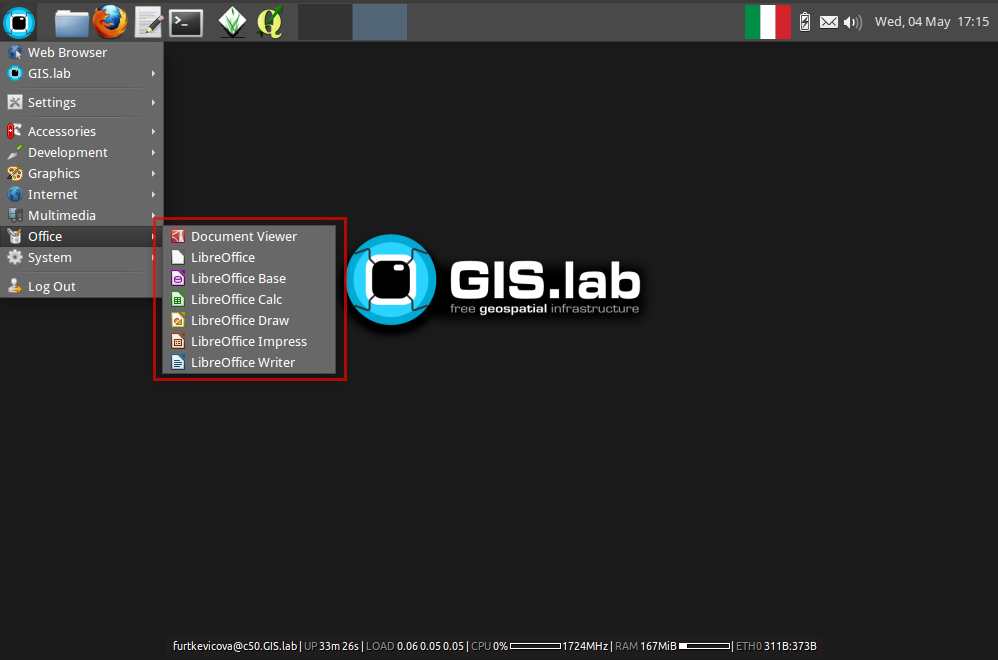
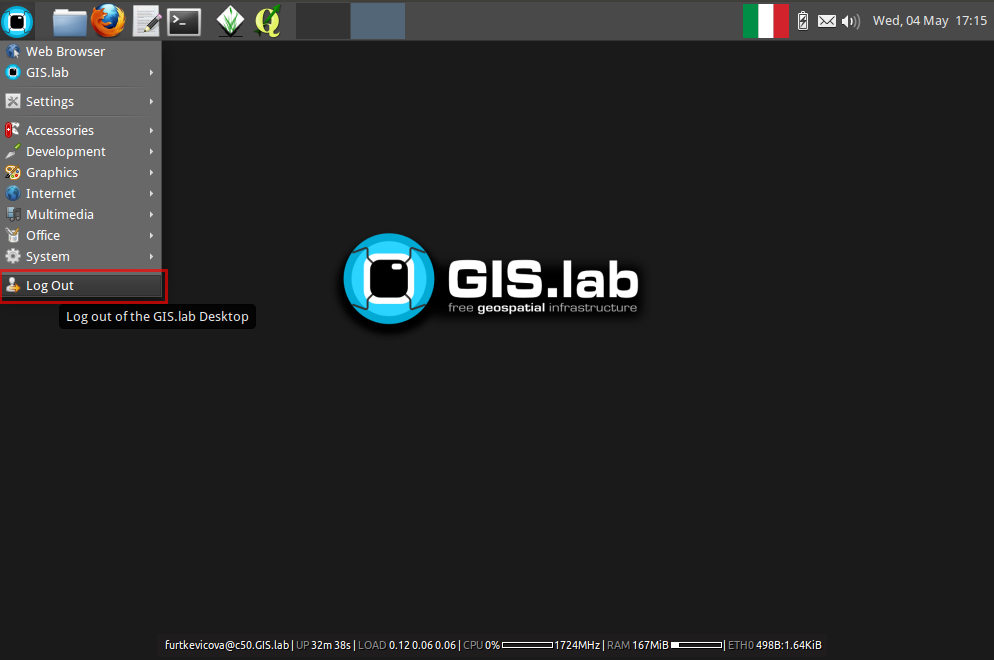

.. _layout:
 
*********************
Client Desktop layout
*********************

Ordinary GIS.lab client environment is shown below. Desktop layout 
is created by main panel, background with GIS.lab logo and in bottom part 
one can see also some basic system information.

.. figure:: ../img/client-layout/client-layout.png
   :align: center
   :width: 450

   Basic GIS.lab client Desktop layout.

Main panel contains:

1. applications launcher
    list of all available applications, settings and log out menu

2. quick launcher
    home directory browser, launchers of the most frequently used applications

3. virtual desktops
    virtual desktops switcher and overview

4. running applications
    running applications list and switcher

5. keyboard layout
    available keyboard layouts switcher

6. battery
    battery status

7. chat
    messaging status

8. sound 
    sound control and network status

9. time
    calendar and time information

----------------
GIS applications
----------------

GIS.lab comes with a bunch of preinstalled GIS applications and
services. **QGIS** and **GRASS GIS** are two core components. `QGIS
<http://qgis.org>`__ is used for GIS project creation, data
preparation, analysis and publication. `GRASS GIS
<http://grass.osgeo.org>`__ can be used for complex data analysis and
manipilation. Due to preinstalled QGIS GRASS plugin GRASS tools can be
accessed also using QGIS user interface.

   QGIS with preinstalled Natural Earth project.
   
.. figure:: ../img/client-layout/client-layout-grass.png
   :align: center
   :width: 450

   Powerful GRASS GIS in GIS.lab client environment.

.. note:: Most of applications are taken from standard Ubuntu
   repositories for `Bionic distribution
   <https://packages.ubuntu.com/bionic/>`__. Up-to-date GIS software
   packages are provided by `GIS.lab PPA
   <https://launchpad.net/~gislab-npo/+archive/ubuntu/production?field.series_filter=bionic>`__.

Beside QGIS and GRASS on desktop client many other GIS tools are
preinstalled. See list below including version numbers.

**Desktop apps**

* `QGIS <http://qgis.org>`__ 2.18
* `GRASS GIS <http://grass.osgeo.org>`__ 7.4
* `SAGA <http://www.saga-gis.org>`__ 2.3
  
**Image processing**

* `OTB <https://www.orfeo-toolbox.org/>`__ 6.0
* `Monteverdi <https://www.orfeo-toolbox.org/CookBook/Monteverdi.html>`__ GUI
  
**Geodatabase**

* PostGIS 2.4 import/export (`shp2pgsql
  <http://postgis.net/docs/manual-dev/using_postgis_dbmanagement.html#shp2pgsql_usage>`__
  and `pgsql2shp
  <http://postgis.net/docs/manual-dev/using_postgis_dbmanagement.html#idm2168>`__)
  command line tools including OSM-related `osm2pgsql
  <https://github.com/openstreetmap/osm2pgsql/blob/master/docs/usage.md>`__ 0.88
  and `osm2pgrouting
  <https://github.com/pgRouting/osm2pgrouting#how-to-use>`__ 2.2 utilities
* SpatiaLite 4.3 `command line
  <https://www.gaia-gis.it/fossil/spatialite-tools/index>`__ and `GUI
  tools <https://www.gaia-gis.it/fossil/spatialite_gui/index>`__

**Libraries**

* GDAL 2.2 `raster <http://gdal.org/gdal_utilities.html>`__ and `vector
  <http://gdal.org/ogr_utilities.html>`__ tools
* `Proj.4 <http://proj4.org/apps/index.html>`__ 4.9 command line
  utilities

**GeoPython**

* `Fiona <http://toblerity.org/fiona/manual.html>`__ 1.7
* GDAL 2.2 Python bindings
* `PyModis <http://www.pymodis.org/>`__ 2.0 
* OTB 6.0 Python bindings
* `OWSlib <https://geopython.github.io/OWSLib/>`__ 0.14
* QGIS Python bindings
* `Rasterio <https://mapbox.github.io/rasterio/>`__ 0.36
* SAGA 2.3 Python bindings
* `Shapely <http://toblerity.org/shapely/manual.html>`__ 1.5
* `Sentinelsat <https://sentinelsat.readthedocs.io/en/stable/>`__ 0.12

**OSM**

* `JOSM editor <https://josm.openstreetmap.de/>`__

-------------------
Common applications
-------------------

GIS.lab brings a lot of useful applications for basic work.

**Accessories**

 * **Calculator** - calculator
 * **KeePassX** - secure personal data management
 * **Leafpad** - plain text editor
 * **Screenshot** - screen shots creator

**Graphics**

 * **GIMP Image Editor** - raster images editor
 * **Inkscape** - vector drawings editor

**Internet**

 * **Firefox Web Browser** - Internet browser
 * **Pidgin Internet Messenger** - GIS.lab chat client

.. figure:: ../img/client-layout/client-layout-chat.png
   :align: center
   :width: 450

   GIS.lab chat client.

.. note:: |note| **IRC server** - To allow effective communication between all 
   GIS.lab users without a need of internet connection, GIS.lab provides 
   built-in IRC server and prepared ``#gislab`` chat room.

**Multimedia**

 * **VLC media player** - video and media player

**Office**

 * **LibreOffice Calc** - spreadsheet editor
 * **LibreOffice Impress** - presentations editor
 * **LibreOffice Writer** - text editor

   Office applications in GIS.lab.

**System**

 * **GIS.lab client informations** - GIS.lab client informations summary important for technical support

----------------
Directory layout
----------------

   Directory layout.

Directory layout consits of traditional folders as :file:`Desktop`,
:file:`Documents`, :file:`Downloads`, and :file:`Templates`. GIS.lab
adds :file:`Project` folder dedicated for storing user GIS
projects. There are also four shared directories:

* :file:`Barrel` - read and write access for all - ideal for quick
  sharing data, files between clients
* :file:`Booster` - mounted part of client machine RAM - ideal for
  quick reading and writing data
* :file:`Publish` - shared folder dedicated for GIS projects
  publication, see :doc:`QGIS Server <../practice/qgis-server>` and
  :doc:`Gisquick publication <../gisquick/publication>` section for
  details
* :file:`Repository` - read-only access for normal users - ideal for
  sharing permanent data

------
Logout
------

User must log out to correctly finish work with GIS.lab client by using 
:menuselection:`Log out` menu available from applications launcher.

   Log out of the GIS.lab Desktop.

.. note:: |note| Client machine shut down is available only from login screen.

   .. figure:: ../img/client-layout/client-shutdown.png
      :align: center
      :width: 450
