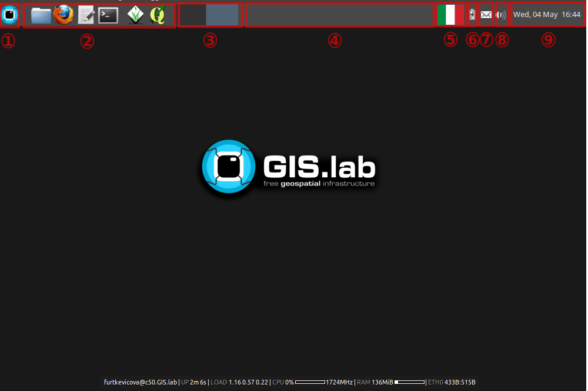
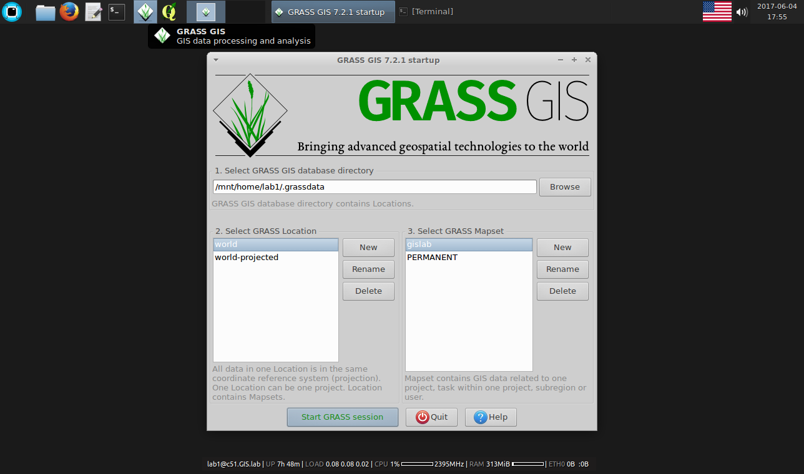

.. _layout:
 
*********************
Client Desktop layout
*********************

Ordinary GIS.lab client environment is shown below. Desktop layout 
is created by main panel, background with GIS.lab logo and in bottom part 
one can see also some basic system information.

   Basic GIS.lab client Desktop layout.

Main panel contains:

1. applications launcher
    list of all available applications, settings and log out menu

2. quick launcher
    home directory browser, launchers of the most frequently used applications

3. virtual desktops
    virtual desktops switcher and overview

4. running applications
    running applications list and switcher

5. keyboard layout
    available keyboard layouts switcher

6. battery
    battery status

7. chat
    messaging status

8. sound 
    sound control and network status

9. time
    calendar and time information

----------------
GIS applications
----------------

**GRASS GIS**

   Powerful GRASS GIS in GIS.lab client environment.

**QGIS**

 * QGIS development support in GIS.lab

  To to automatize building and installation of QGIS software from Git source 
  code, following scripts should be run on client machine.
  First of them downloads latest QGIS source code and makes install
  and second script runs QGIS installed from source code.

  1. ``gislab-dev-qgis-install`` 
  2. ``gislab-dev-qgis`` 

 * QGIS GIS.lab edition

   QGIS GIS.lab edition.

-------------------
Common applications
-------------------

GIS.lab brings a lot of useful applications for basic work.

**Accessories**

 * **Calculator** - calculator
 * **KeePassX** - secure personal data management
 * **Leafpad** - plain text editor
 * **Screenshot** - screen shots creator

**Graphics**

 * **GIMP Image Editor** - raster images editor
 * **Inkscape** - vector drawings editor

**Internet**

 * **Firefox Web Browser** - Internet browser
 * **Google Earth** - 3D earth browser from Google
 * **Pidgin Internet Messenger** - GIS.lab chat client

   GIS.lab chat client.

.. note:: |note| **IRC server** - To allow effective communication between all 
   GIS.lab users without a need of internet connection, GIS.lab provides 
   built-in IRC server and prepared ``#gislab`` chat room.

**Multimedia**

 * **VLC media player** - video and media player

**Office**

 * **LibreOffice Calc** - spreadsheet editor
 * **LibreOffice Impress** - presentations editor
 * **LibreOffice Writer** - text editor

.. figure:: ../img/client-layout/client-layout-office.png
   :align: center
   :width: 450

   Office applications in GIS.lab.

**System**

 * **GIS.lab client informations** - GIS.lab client informations summary important for technical support

----------------
Directory layout
----------------

.. figure:: ../img/client-layout/client-layout-dir.png
   :align: center
   :width: 450

   Directory layout.

------
Logout
------

User must log out to correctly finish work with GIS.lab client by using 
:menuselection:`Log out` menu available from applications launcher.

.. figure:: ../img/client-layout/client-layout-logout.png
   :align: center
   :width: 450

   Log out of the GIS.lab Desktop.

.. note:: |note| Client machine shut down is available only from login screen.

.. todo:: |todo| Changes related to **Ubuntu 16.04 Xenial**
