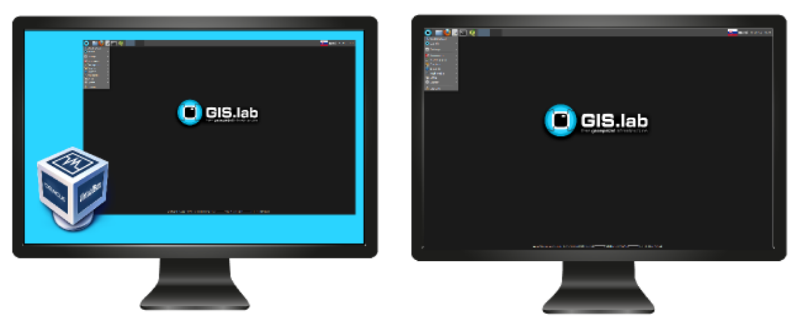
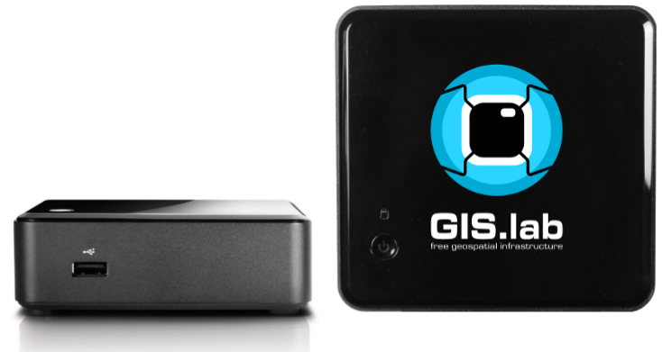
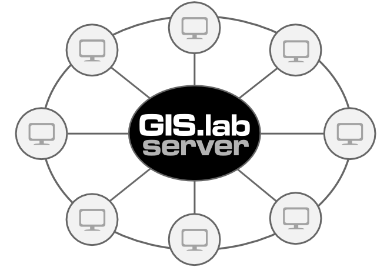
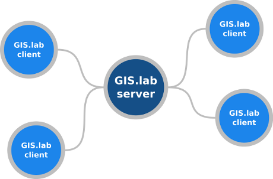
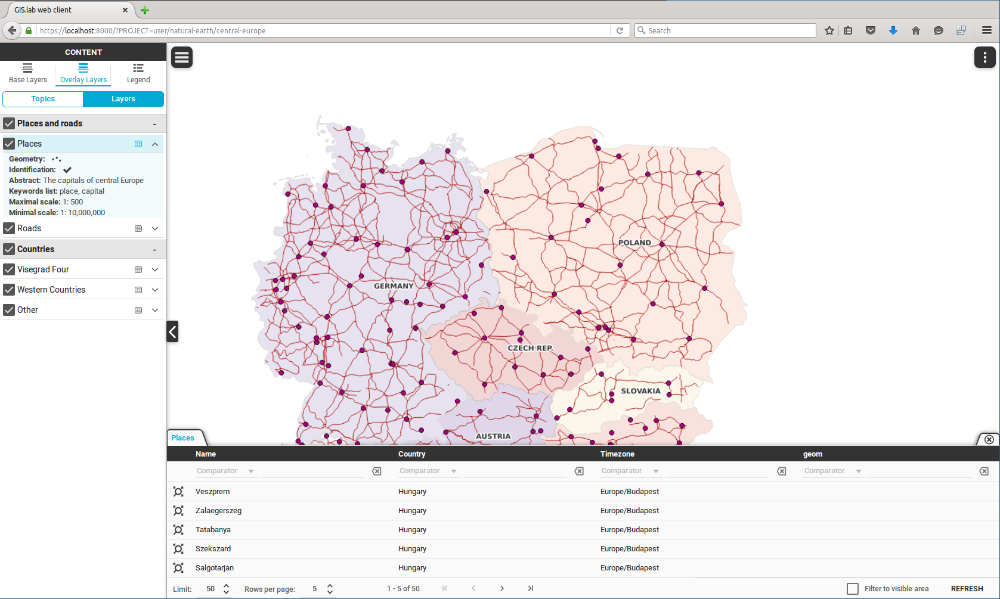

.. _about:

*************************
Learning about the pieces
*************************

.. _gislab:

================
What is GIS.lab?
================

GIS.lab is a tool for simple, unbreakable, always ready and clean deployment 
of multiple machines running software mainly for Geographic 
Information Systems (GIS) as well as for office. 

It is **free technology** which can instantly turn any computer
network into fully equipped geospatial cluster. It is capable to deploy 
a complete, centrally managed 
and horizontally scalable geospatial infrastructure in local area network, 
data center or cloud in a few moments. 
It is provided as comprehensive set of free geospatial software 
seamlessly integrated into one, easy-to-use system with out-of-box running 
services capable to run with minimal maintenance requirements for desktop, web 
and mobile client interfaces.

.. _gislab-schema:

.. figure:: ../img/general/gislab-schema.png
   :align: center
   :width: 450

   Schema representing what GIS.lab is all about.

GIS.lab lowers deployment and ownership cost of complex geospatial solution 
to absolute minimum, while still keeping whole technology in house and under 
full control.

GIS.lab Desktop is traditional, customized, low resources environment with
office and geospatial software. This technology promotes combination of desktop 
performance with web accessibility.

There are two different ways of launching GIS.lab Desktop. Depending on future 
usage, hardware and software possibilities and other similar factors, GIS.lab 
Desktop can be implemented using **virtal** or **physical** mode.

Virtual mode can be used for any operating system. Original operating system 
and GIS.lab will be **available**. On the other hand, physical mode 
represents best performance but original operating system is **temporary lost**.

.. _physical-or-virtual-mode:

   GIS.lab Desktop launched in virtual or physical mode.

==============================
What can be GIS.lab ideal for?
==============================

This solution offers very large number of possible deployment scenarios.

GIS.lab can be used in places and conditions where deployment of any other 
technology would not be affordable or technically possible. GIS.lab is capable 
to turn bunch of heterogeneous or broken computers in to **crisis management** 
command center, flawlessly working in very hard conditions of natural disaster 
with power, internet outages and no dependencies. 

It can be used at **schools** as central management with maintenance-free 
clients. Students can gain various knowledge from Linux systems principles 
to GIS development.

GIS.lab can be useful for **science institutions** which can effectively use 
horizontally scalable computing power, advanced tools and extensibility. 

Next, **small projects** or **poor countries** 
can appreciate affordable, complete solution, low system requirements and 
already mentioned maintenance-free clients. GIS.lab can save huge amount of 
obtaining and maintenance costs.

Or in any case, it can serve as ideal system just for 
`Open Source <https://en.wikipedia.org/wiki/Open-source_software>`_ 
technologies popularization.

================
Fundamental aims
================

One of the main objectives is rapid deployment of complete **geospatial solution** 
for collaborative data capturing, processing, analysis and publication on web
with fully **automatic provisioning** and **out of box working deployment** 
using GIS.lab unit.

It is self containing system with very quick results, possible to get web
application from plain hardware.
GIS.lab brings high added values by integration of precisely chosen set of 
geospatial **FOSS**, i.e. one best tool for one thing to one system with 
consistent behaviour, many collaboration tools, user and software support.

Full client computer performance utilisation represents opposite to thin client.
It provides real desktop experience without any thin-client glitches.
Rather than a traditional desktop, GIS.lab provides thinking about client 
environment more as about some kind of specialized client interface 
providing tools from desktop world. 
It allows computer resources sharing, same deployment in LAN and cloud, 
mobile clients and web administration similar to router or NAS (plans).

===============
How it is done?
===============

GIS.lab consists from one host machine running **Linux**, **Windows** or **Mac** 
operating system and any number of client computers with nearly no 
requirements. No operating system, even no hard disk is required 
but no problem if they exist. 
All these computers must be connected with gigabit cables and switch. 

Automatic provisioning is enabled by **Ansible** characterised by human-readable 
automation language, self-documenting syntax, agent-less execution, 
idempotent modules, templates, support for cloud providers AWS, GCE, Digital 
Ocean, Azure, and the like.

Virtual machine deployment is enabled by 
**Vagrant** and **VirtualBox**. Client boot service is 
`Linux Terminal Server <http://www.ltsp.org/>`_
fat client or own solution. It uses OGC Web Service Common (OWS) services 
load balancing, QGIS Desktop and Server as 
GIS.lab Desktop including own GIS.lab Web app, own GIS software packaging and 
GRASS as processing backend under QGIS Processing plugin and WPS. 

Magic command is called ``vagrant up`` and orders to automatically 
provision GIS.lab server inside of virtual machine on the host computer. 

.. _key-sw:

   Key softwares for GIS.lab provisioning.

==========================
What are the key benefits?
==========================

The main advantages are **fully automatic installation** or immediate deployment 
with GIS.lab unit appliance, **central management** of all machines, user accounts 
and backups high performance, maintenance free **desktop** interfaces. 

**Web** and **mobile** client interfaces, web administration interface computing 
resources sharing across all machines, 
well known free software with high added value of seamless integration 
and bug fixes are some of other main qualities. 

Useful benefits are also
central software distribution, easy customization, automatic clustering and 
computing power sharing, no dependencies, etc.

=================================
What about software requirements?
=================================

At a minimum, your PC needs some necessaries. For this kind of facts,
see hardware and software requirements for 
:ref:`virtual <requirements-virtual>` or :ref:`physical <requirements-physical>` 
mode.

.. _gislab-unit:

=====================
What is GIS.lab unit?
=====================

GIS.lab unit appliance is a hardware solution containing installation of 
GIS.lab system which is ready for immediate plug-and-play deployment and 
user friendly management using web administration interface.

With a view to further specifying the hardware, GIS.lab unit can be presented as 
**Intel Haswell**, **16 GB RAM**, **SSD**, tested with **20 clients**, 
portable, pocket size (11 x 11 x 4 cm) device with automatic host network 
adaptation. 

.. _gislab-unit-png:

   GIS.lab unit.

===============
GIS.lab cluster
===============

GIS.lab cluster is managed by decentralized cluster management tool
called `Serf <https://www.serfdom.io/intro/>`_ based on
**GOSSIP** protocol. Serf is responsible for automatic joining and removing
machines to and from GIS.lab cluster and OWS load balancer management
and can serve as failure detection system.
This automatic cluster orchestration system is also used as interface for 
running cluster **events** and **queries**.

.. _gislab-cluster:

   GIS.lab cluster architecture.

-------------------------
Roles, events and queries
-------------------------

Machines belonging to GIS.lab cluster are divided into two roles:

1. **server** 
2. **client**

.. _gislab-architecture:

   GIS.lab server and GIS.lab clients.

All machines are capable of running different set of `cluster 
events <https://www.serfdom.io/docs/commands/event.html>`_ and
`queries <https://www.serfdom.io/docs/commands/query.html>`_ depending
on their role membership. Events and queries can be send from any
machine which is a member of GIS.lab cluster using **gislab-cluster client** 
which is currently just symlink to serf binary or
programmatically using `RPC mechanism <https://www.serfdom.io/docs/agent/rpc.html>`_. 
All machines in cluster will receive all events and queries and will decide to
respond or not depending on existence of
`handler <https://www.serfdom.io/docs/agent/event-handlers.html>`_
responsible for particular event or query.

The main difference between **event** and **query** is that while query is
designed to send some query and receive response, the purpose of event
is just to announce that something has happend or should happen without
receiving any response. Response from query can be returned in two
formats, ``text`` or ``JSON``.

.. seealso:: |see| `Public events and queries <public-events-and-queries>`

.. _gislab-web-about:

====================
What is GIS.lab Web?
====================

GIS.lab Web is a **web application** built on top of modern technologies with 
very modern user interface optimized also for mobile devices. It stands on the 
shoulders of `QGIS <http://qgis.org/en/site/>`_ desktop and server software.

The main purpose is QGIS projects publishing on web. 

.. _gislab-web-ui:

   GIS.lab Web interface.

=================================
Is GIS.lab similar to OSGeo Live? 
=================================

GIS.lab is automatic deployment of GIS infrastructure - more or less opposite to 
OSGeo Live.

OSGeo-Live is a self-contained bootable DVD, USB thumb drive or
Virtual Machine based on Lubuntu that allows user to try a wide
variety of free and open source geospatial software without installing
anything, it is like a Linux distribution.

GIS.lab is a operative system that uses a server where it is installed
and server clients can attach to it using a LAN. It is easily
configurable and it contains by default some of the most used free and
open source geospatial software.
