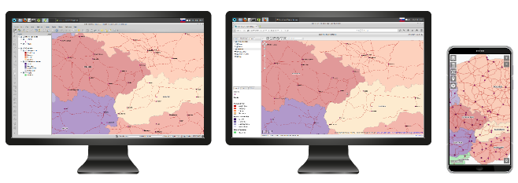
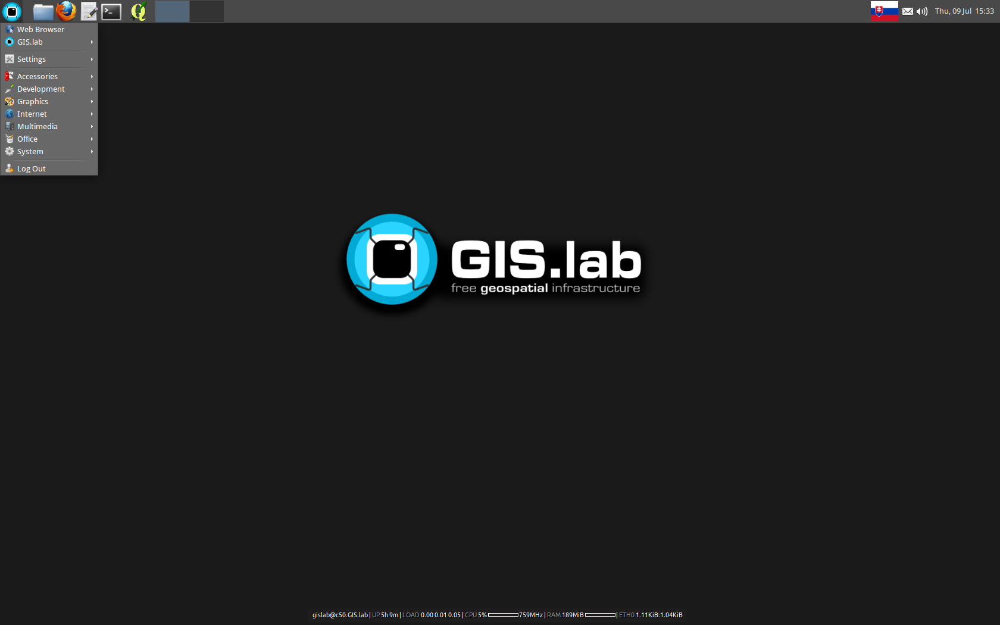

.. _start:

*****************
Let's get started
*****************

You may be coming to :ref:`GIS.lab <about>` from various operating systems, 
but we expect that you are probably 
familiar with browsing the web, writing documents, sending emails and doing other
job related tasks with your computer. Whether you are somewhat experienced or
completely new to computers, this documentation should be very useful for you.
Of course, the more experience you have, the more quickly you will learn. 

In general, this documentation does not assume any computer experience on your 
part. We try to explain in detail what :ref:`GIS.lab Desktop<gislab>`, 
:ref:`GIS.lab Web <gislab-web>` and GIS.lab Mobile are. 
We even tell you how to install 
and how to use every of these pieces in the most efficient way. 

.. _desktop-web-mobile:

   GIS.lab Desktop, GIS.lab Web and GIS.lab Mobile interface.

Firstly, there is a section related to introduction called 
:ref:`Learning about the pieces <about>`. 
In case you feel sufficiently familiar with all the introductory parts, just skip 
them and go straight away to :ref:`GIS.lab Installation <gislab-installation>`. 
Section :ref:`Client Desktop layout <layout>` relates to GIS.lab client
environment with GIS and no GIS applications.
To get to know about QGIS projects publishing on web, see 
:ref:`GIS.lab Web <gislab-web>` part.
Chapters dedicated to provide practical skills with GIS.lab technology
are :ref:`GIS.lab in practice <practice>` and :ref:`GIS.lab workshop <workshop>`.
Another useful parts can be :ref:`Useful terms <terms>` 
or :ref:`Useful commands <commands>`.
To distinguish between different kinds of information we use some typographical
and stylistic features, see chapter
:ref:`Conventions used in this documentation <conventions>`. 

.. _gislab-desktop-start:

   GIS.lab Desktop screen.

Moreover, when you meet some troubles or difficulties, you can find solutions to 
simple and difficult problems in :ref:`Tips and tricks <tips>` part.
