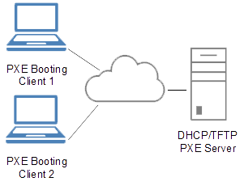

.. _terms:

************
Useful terms
************

*AMD64*
   platform, the 64-bit version of the x86 instruction set, x86 means 32-bit OS

*Ansible*
   an easy to use configuration management and orchestration tool; it is platform 
   that can combine multi-node software deployment and ad hoc task execution; 
   it’s configuration, deployment, and orchestration language are playbooks
   expressed in **YAML** format; `Ansible <http://docs.ansible.com/ansible/index.html>`_ 
   is an automation engine similar to 
   `Chef <https://www.chef.io/>`_ or `Puppet <https://puppetlabs.com/>`_, 
   that can be used to ensure deployment and configuration consistency 
   across many servers, and keep servers and applications up-to-date

*Bridged networking*
   connects a virtual machine to a network by using the network adapter on the 
   host system, the virtual machine is a full participant in the network

   Bridged Networking Configuration [#bnc]_

*Client machine*
   machine which runs GIS.lab client system launched from GIS.lab server

*Client's root*
   concrete directory on GIS.lab server in which GIS.lab client is installed 
   with a special tool named ``debootstrap``; it has almost the same filesystem
   hierarchy as a standard xubuntu desktop installation with GIS.lab integration
   changes - and this is what one can see in running GIS.lab client; from this 
   directory is then created GIS.lab client image which is mounted over network 
   as a `client's root partition` during boot process

*Configuration*
   an arrangement of functional units, often pertains to the choice of hardware, 
   software, firmware, and documentation; it affects system function and performance

*Containers*
   can share a single Linux Kernel and optionally other binary and library 
   recources, compared with virtual machines that require a full operating system 
   image for each instance

*Customization*
   means doing some modification over an existing applications according to 
   requirements of the client

*Dev*
   development tools, software developer or device in PC

.. _dhcp-server:

*DHCP server*
    *Dynamic Host Configuration Protocol* is way how to set host's IP address to 
    automatically assign an IP address to any host on the network upon the request
    (in order for two hosts communicate on the same network using TCP/IP model, 
    both hosts need to have an unique IP address); GIS.lab has own DHCP server

.. figure:: ../img/terms/dhcp.gif
   :align: center
   :width: 250

   DHCP server [#dhcp]_

*Django*
   is a free and open-source web framework, written in Python, which follows 
   the model–view–controller architectural pattern with primary goal to ease 
   the creation of complex, database-driven websites, reuse various components 
   emphasizing principle of don't repeat yourself

*DNS server*
   *Domain Name System* is a protocol within the set of standards for 
   how computers exchange data on the internet and on many private networks, 
   known as the TCP/IP protocol suite; its basic job is to turn a user-friendly 
   domain name like ``qgis.com`` into an IP address like ``91.142.249.5`` 
   that computers use to identify each other on the network; 
   also it is used to don’t have to remember IP addresses, domain names are much 
   easier to remember;
   user will need at least one DNS server address but can enter up to three 
   addresses in case one server is unavailable; if user does not know it’s DNS 
   server addresses, Google has DNS servers that anyone in the world can use for 
   free, the addresses of these servers are ``Primary 8.8.8.8`` and 
   ``Secondary 8.8.4.4``
   
.. figure:: ../img/terms/dns.jpg
   :align: center
   :width: 450

   Domain name system workflow [#dns]_

*Gateway*
   is an IP address of the device that machine looks to for access to the 
   internet; usually, it is the router’s IP address

*GIS.lab node*
   GIS.lab client environment which runs on client machine

*GIS.lab master* 
   GIS.lab server environment which runs on host machine; 
   it acts as conventional server providing boot service, file, geo-database 
   or chat server

*Git*
   is a distributed version control system often used to work on some code 
   together, it allows groups of people to work on the same files at the same 
   time to develop various software; it runs command line on local machine and 
   allows to 
   keep track of files and modifications to those files in something called 
   `repository`; every developer can work independently and then merge changes 
   together while everything is recorded by Git 

*GitHub*
   is a web side that allows to upload Git repositories online; unlike Git, 
   GitHub provides graphical interface for private repositories and free accounts
   usually used to host open-source projects

*GDAL/OGR*
   *Geospatial Data Abstraction Library* provides access to geospatial data, 
   it is a cross platform **C++** translator used for reading, writing and 
   transforming raster (GDAL) and vector (OGR) data to the calling application 
   for all supported formats; a variety of useful command line utilities for data 
   translation and processing are used

*GUI*
   *Graphical User Interface*

*Hardware virtualization*
   refers to the creation of a virtual machine that acts like a real computer 
   with an operating system; softwares executed on these virtual machines
   are separated from the underlying hardware resources

*Host machine*
   is main machine where required softwares and GIS.lab package are installed

*Chroot*
   is a tool which enables installation in client environment; installation 
   to client's ``root`` is done within ``chroot`` operation

*I386, x86*
   ordinary platform, 32-bit microprocessor

*IA64*
   platform, 64-bit microprocessor

.. _ip-address:

*IP address*
   *Internet Protocol address* is unique numerical identifier assigned to each 
   device participating in a computer network that uses the Internet Protocol for 
   communication; it is 32-bit numeric address written as four numbers ``0.0.0.0`` 
   separated by periods, each number can be zero to ``255``; it is assigned as part 
   of connecting to a network; 
   it is used for identifying computer on the network; when 
   connecting using DHCP, this address will periodically change (hence, the 
   name ``dynamic``), in case of static IP address configuration, address will 
   never change

*ISO*
   an archive file of an optical disc; image file is a snapshot of the data and 
   layout of a CD or DVD, saved in ``ISO-9660`` format widely used for storing CD 
   content; it contains raw dumps of a magnetic disk or of an optical disc

*LAN*
   *Local Area Network* is a computer network interconnecting computers 
   within a limited area, e.g. school or office building

*LDAP*
   *Lightweight Directory Access Protocol* is an open protocol that email 
   and other programs use to look up information from a server, allows to 
   access information directories and obtain these information

*LXC*
   *Linux Container* is a lightweight virtualization technology on operating 
   system level for running multiple isolated Linux systems, i.e. containers 
   on a control host using a single Linux kernel

*MAC address*
   *Media Access Control address* is kind of serial number assigned to every 
   network adapter; no two anywhere 
   should have the same MAC address; it is assigned at the time hardware is 
   manufactured, the computer needs to have its MAC address registered in 
   the DNS/DHCP so that it'll be recognized and get the right IP address,
   six groups of two hexadecimal digits separated by colons ``0:0:0:0:0:0`` or
   by hyphens ``0-0-0-0-0-0`` or three groups of four hexadecimal digits 
   separated by dots ``0.0.0``

*Network mask*
   tells computer the size of the network to which it is being connected, it is 
   formatted the same way as the IP address, but usually looks something 
   like ``255.255.255.0``

*NIC*
   *Network Interface Card* is a computer hardware component that enable 
   connecting computer to a computer network physically. It is a circuit 
   board or card that is installed in a computer

*PXE booting*
   *Preboot Execution Environment* booting, is a method of having an end computer 
   (client) boot using only its network card, 
   it is industry standard client/server 
   interface that allows networked computers that are not yet loaded with an 
   operating system to be configured and booted remotely by an administrator,
   PXE provides e.g. DHCP, application program interfaces that are 
   used by the client's Basic Input/Output Operating System (BIOS), etc. 

   PXE overview [#pxe]_

*Serf*
   *Service orchestration and management tool* is a decentralized solution for 
   service discovery and orchestration; it uses an efficient and lightweight 
   gossip protocol to communicate with other nodes, it can detect node failures 
   and notify the rest of the cluster

   Serf as a decentralized solution for service discovery and orchestration.

*Software framework*
   is an abstraction in which software providing generic functionality can be 
   selectively changed by additional user-written code, thus providing 
   application-specific software

*Tmux*
   *Terminal multiplexer* is a software application usually used to multiplex 
   several virtual consoles, enabling a number of terminals to be created, 
   accessed, and controlled from a single screen; it may be detached from 
   a screen and continue running in the background, then later reattached

*Travis CI*
   a FOSS, hosted, distributed continuous integration service used to build 
   and test software projects hosted at GitHub, it is configured by adding a 
   YAML format text file to the root directory of the repository

*Vagrant*
   a cross-platform tool for working with Virtual Machines, it does networking 
   out-of-the-box and solves problems in a modular way, it represents the command 
   line utility for managing the lifecycle of virtual machines,
   to describe the type of machine required for a project, and how to configure 
   and provision these machines *Vagrantfile* with Ruby syntax is used,
   process means **set up** - downloading and installing Vagrant, 
   **configure** - creating a single file with description and 
   **work** - running ``vagrant up``

*Vagrant box*
   the package format for Vagrant environment, it is used to bring up an 
   identical working environment, 

*Vendor*
   supplier, a part of the supply chain

.. seealso:: |see| `19 Minutes With Ansible <https://sysadmincasts.com/episodes/43-19-minutes-with-ansible-part-1-4>`_, 
   `Booting from the network with PXE <https://www.youtube.com/watch?v=zQ-TQhmjhuc>`_, 
   `Vagrant in 5 minutes <https://opensource.com/business/16/1/lightning-talk-quick-introduction-vagrant?sc_cid=701600000011jJaAAI>`_, 
   `How Domain Name Servers Work <http://computer.howstuffworks.com/dns.html>`_

.. rubric:: Sources

.. [#bnc] `Configuring Bridged Networking <http://pubs.vmware.com/ws8/wwhelp/wwhimpl/js/html/wwhelp.htm#href=using_ws/GUID-BAFA66C3-81F0-4FCA-84C4-D9F7D258A60A.html#1_14_9_1>`_
.. [#dhcp] `DHCP server <http://www.tomshardware.co.uk/faq/id-1932036/dhcp-server-assigns-addresses-client-computers.html>`_
.. [#dns] `How does DNS work? <http://brightmags.com/how-does-dns-work/>`_
.. [#pxe] `Preboot Execution Environment <https://en.wikipedia.org/wiki/Preboot_Execution_Environment>`_
