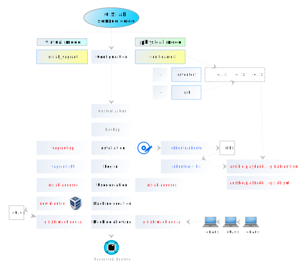

.. _workshop:

****************
GIS.lab workshop
****************

======
Issues
======

-----------------------
Introduction to GIS.lab
-----------------------

* `GIS.lab NPO on GitHub <https://github.com/gislab-npo>`_
* :ref:`Manual page of GIS.lab documentation <gislab-main>`
* :ref:`Let's get started <start>`

  * general information
  * required computer experience and skills
  * GIS.lab interfaces

---------------------------
Getting technical knowledge
--------------------------- 
  
* :ref:`Learning about pieces <about>`

  * most useful questions and answers

* :ref:`Useful terms <terms>`

  * introduction to Ansible
  * general definitions and concepts

* :ref:`Useful commands <commands>`
  
  * GIS.lab management commands
  * Vagrant commands 

--------------------
GIS.lab installation
--------------------

* :ref:`GIS.lab installation <gislab-installation>`

   * configuration for virtual and physical mode
   * server, user accounts and client customization 
   * hardware and software requirements
   * installation in virtual mode, running GIS.lab virtual client
   * installation in physical mode, running GIS.lab physical client

.. _installation-workflow:

   Installation workflow.

---------------------
Client Desktop layout
---------------------

* :ref:`Client Desktop layout <layout>`

  * introduction to GIS.lab client environment - shared folders, projects, 
    publish, booster, software, services, PostgreSQL schemas, chat, etc.

---------------------------
Introduction to GIS.lab Web
---------------------------

* :ref:`GIS.lab Web <gislab-web>`

  * creating development environment
  * GIS.lab Web plugin introduction
  * project publishing and GIS.lab Web layout 

----------------
Practical issues
----------------

* :ref:`GIS.lab in practice <practice>`
 
  * customization examples, cluster management, example of machine booting
  * creation of GIS projects in GIS.lab, publishing in GIS.lab Web,
    available data sets for GIS.lab workshop

.. important:: |imp| This is elementary draft!
