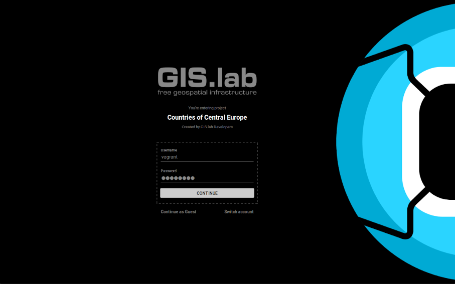

.. |imp.| image:: img/paragraphs/important.png
   :width: 1.5em

.. _gislab-main:

.. raw:: html

   <h1>
Welcome to GIS.lab documentation!
</h1>
   

   
<em> ... from nothing to multi-node geospatial cluster with map for 
   web and mobile in few minutes!</em>

   

   
<em>Your voyage to land of GIS.lab starts here. 
   Go beyond the basics and unleash the full power of GIS.lab with useful,
   step-by-step examples how to install it, use it and take your first 
   step.</em>

   

========
Contents
========

.. toctree::
   :maxdepth: 1

   general/start
   general/about

.. toctree::
   :maxdepth: 2

   installation/index
   client-layout/index
   gislab-web/index
   practice/practice
   general/workshop
   general/datasets

.. toctree::
   :maxdepth: 1

   general/terms
   general/commands
   general/conventions
   general/tips
   general/communication
   general/credits

.. important:: |imp.| GIS.lab is still in Pre-Release state.
