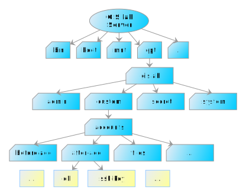
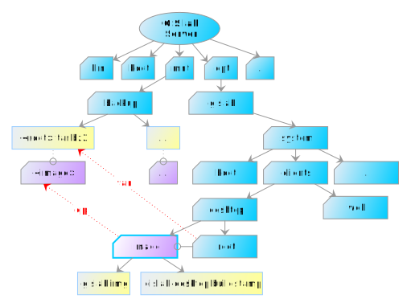
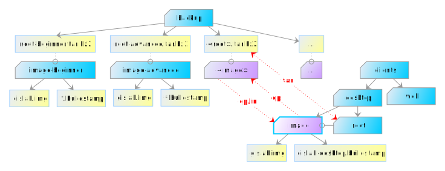

.. _gislab-customization:
 
*************
Customization
*************

When talking about customization, we should distinguish between:

1. :ref:`Server customization <server-customization>`
2. :ref:`User accounts customization <user-customization>`
3. :ref:`Client customization <client-customization>`

.. _server-customization:

====================
Server customization
====================

GIS.lab Server can be customized by running standard Linux/Ubuntu
commands, but it is recommended to use some isolated environment like
`LXC <https://linuxcontainers.org/lxc/introduction/>`_ or 
`Docker <https://www.docker.com/>`_ containers when deploying custom service.

.. seealso:: |see| `Understanding the key differences between LXC and Docker <https://www.flockport.com/lxc-vs-docker/>`_

.. _user-customization:

===========================
User accounts customization
===========================

Process of creation and removal of GIS.lab user accounts can be
customized by special scripts. 

.. important:: |imp| Scripts must have executable permissions assigned and 
   can't contain file extension, see ``man run-parts``. 

Directory ``/opt/gislab/custom/accounts`` in figure :num:`#customization-files` 
contains following directories with customization scripts.

* ``before add`` - executed before account is created
* ``after add`` - executed before account is deleted
* ``before delete`` - executed before account is deleted
* ``after delete`` - executed after account is deleted
* ``files`` - content of this directory is copied to user's home directory 
  before ``after-add`` hooks are executed

.. _customization-files:

   File layout related to customization.

In above customization scripts it is possible to use various variables. 
When creating or deleting GIS.lab user account using ``gislab-adduser`` and 
``gislab-deluser`` commands, following variables can be used.
 
  * ``GISLAB_USER`` - user name 
  * ``GISLAB_USER_GIVEN_NAME`` - first name 
  * ``GISLAB_USER_SURNAME`` - last name 
  * ``GISLAB_USER_EMAIL`` - email 
  * ``GISLAB_USER_DESCRIPTION`` - description
  * ``GISLAB_USER_SUPERUSER`` - superuser status 
  * ``GISLAB_USER_GROUPS`` - groups membership

For content stored in ``files`` directory, it is possible to use template
variables in following format. 

* gislab-adduser 

  * ``{+ GISLAB_USER +}`` - user name 
  * ``{+ GISLAB_USER_GIVEN_NAME +}`` - first name 
  * ``{+ GISLAB_USER_SURNAME +}`` - last name 
  * ``{+ GISLAB_USER_EMAIL +}`` - email 
  * ``{+ GISLAB_USER_DESCRIPTION +}`` - description 
  * ``{+ GISLAB_USER_SUPERUSER +}`` - superuser status 
  * ``{+ GISLAB_USER_GROUPS+}`` - groups membership

Example customization script ``db`` in ``after-add`` directory for automatic 
database schema creation called **schemaname** after new GIS.lab user is added 
is shown below.

.. code:: sh

   #!/bin/sh
   
   create_schema() {
       if [ ! -z `sudo -u postgres psql -lqt | cut -d \| -f 1 | grep -w $1` ]; then
           echo "CREATE SCHEMA $GISLAB_USER;
   GRANT USAGE on SCHEMA $GISLAB_USER to $GISLAB_USER;
   GRANT SELECT ON ALL TABLES IN SCHEMA $GISLAB_USER TO $GISLAB_USER;
   GRANT all ON SCHEMA $GISLAB_USER to $GISLAB_USER" | \
               sudo -u postgres psql $1
       fi
   }
   
   create_schema schemaname
       
   exit 0

.. _client-customization:

====================
Client customization
====================

.. note:: |note| In the following lines basics of GIS.lab client's customization 
   will be described. GIS.lab client means **GIS.lab Desktop client**. There can 
   also be **GIS.lab Web client**, etc.

GIS.lab client can be customized by running standard Linux/Ubuntu commands as
well as :ref:`GIS.lab server <server-customization>`. Difference is that they 
must be executed in isolated environment called **chroot**. Administrator 
scripts :ref:`gislab-client-shell <gislab-client-shell>` 
and :ref:`gislab-client-image <gislab-client-image>` are used to perform this 
action. 

Fundamental file is **image file**. It is a binary file with the ``.img`` filename 
extension and represents a snapshot of the data and layout of some GIS.lab
client. More specifically, it is compressed client's ``root``. 
All GIS.lab users boot from some image file. 
Usually after entering client's ``root`` with the first of above mentioned commands, 
the new updated ``image`` is rebuilded by the second of these commands. 

.. danger:: |danger| Client's ``root`` and resulting ``image`` are always restored 
   to original state after every GIS.lab upgrade, so customization must be
   applied again.

.. note:: |note| This behaviour is planed to be changed in future.

Important danger note written above is precisely why **backup** should always be used. 
In general, it is very good idea to backup client's ``root`` and also ``image`` 
in case if something will go wrong in process of customization or rollback is
required. Backup operation can be done by simple backup of them. 
Approximate total backup size is ``2 GB``.

Backup of client's ``root`` directory can be created by following statement
using tape archive command.
Command for client's ``image`` backup is introduced below. 

.. code:: sh

   $ sudo tar cjf /mnt/backup/<root>.tar.bz2 /opt/gislab/system/clients/desktop/root
   $ sudo cp -a /opt/gislab/system/clients/desktop/image /mnt/backup/<image>

See also figure :num:`#backup` for clearer understanding.

.. _backup:

   Recommended backup of client's files.

.. note:: |note| Backup of client's ``image`` file is not necessary because 
   it can always be created by ``gislab-client-image`` command from particular 
   GIS.lab client's ``root``. Why also this backup is useful will be introduced later.

When the recommended backups are created, it is time to start with customization.
If backup directory contains some backup of client's ``root`` and image it is 
possible to use them, i.e. :ref:`recover backup <recover-backup>`.

.. _recover-backup:

First, current client's ``root`` and ``image`` should be **removed** and afterwards, 
selected backup of them can be recovered.

.. code::

   $ sudo rm -r /opt/gislab/system/clients/desktop/root
   $ sudo rm -r /opt/gislab/system/clients/desktop/image

   $ sudo tar xjf /mnt/backup/<root>.tar.bz2 -C /
   $ sudo cp -a /mnt/backup/<image>/ /opt/gislab/system/clients/desktop/image

.. seealso:: |see| See :ref:`practical example <example-gdal>` of custom 
   installation of latest GDAL version on GIS.lab client from source code.

.. rubric:: Using symbolic links

Violet diagram with blue line color called ``image`` in figure :num:`#backup` 
containing ``gislab.img`` binary file and ``gislab-desktop.buildstamp`` in 
``/opt/gislab/system/clients/desktop`` directory 
can be directory or symbolic link. By default it is directory.

But it is very smart and handy to have more versions of image 
and just switching between them by symlink with nickname ``image`` and refer 
to particular directory with ``gislab.img`` and ``gislab-desktop.buildstamp``.

.. note:: File ``gislab.img`` is compressed client's ``root`` directory. 

For example ``image`` will stay in ``/mnt/backup`` directory after 
:ref:`backup <backup>` process mentioned above. 
Let's say there are two different images for two different courses - beginner
and advanced . They cause different customization of users. 

When one wants to select desired image, following
steps from ``/opt/gislab/system/clients/desktop`` directory should be used.

.. code::

   # get list of all saved versions of image
   $ (cd /mnt/backup/; ls -la)
   root-advanced
   root-beginner
   root-advanced.tar.bz2
   root-beginner.tar.bz2
   ...
   # remove current image and root
   $ sudo rm -r image
   $ sudo rm -r root
   # switch to image for advanced course
   $ sudo ln -s /mnt/backup/root-advanced image
   # extract corresponding root from backup
   $ sudo tar xjf /mnt/backup/root-advanced.tar.bz2 -C /

Then continue with creation of new user prepared for advanced course. See 
principle in figure :num:`#image-symlink`.

.. _image-symlink:

   Principle of using symlinks for effective customization.

.. note:: |note| When user booted from some ``image`` which has already been 
   changed, during logout he is notified that there is new version of system
   with ``A new version of a system is available, rebooting in 10s.``
   Running client is automatically rebooted.

.. todo:: |todo| prejsť!

It is recommended to use Ansible to execute customization scripts directly 
from local machine. See :ref:`Executing customization scripts from 
Ansible <customization-ansible>` example.

Ansible uses ``*.yml`` format to perform customization.

.. important:: |imp| GIS.lab master has to run during customization.

===========
Boot loader
===========

To customize GIS.lab Desktop client **boot loader**, create copy of boot loader 
source file ``http-boot/gislab-bootloader.ipxe`` 
and modify it as required. For more information about **iPXE** syntax see 
documentation. Than follow build process below.

Firstly, download iPXE source code.

.. code:: sh

   git clone git://git.ipxe.org/ipxe.git && cd ipxe

Optionally checkout to version used by GIS.lab by typing

.. code:: sh

   git checkout d644ad41f5a17315ab72f6ebeeecf895f7d41679

Finally build customized ISO image ``bin/ipxe.iso``

.. code:: sh

   $ cd src
   $ make EMBED=CUSTOM-BOOT-LOADER-SOURCE-FILE.ipxe 
