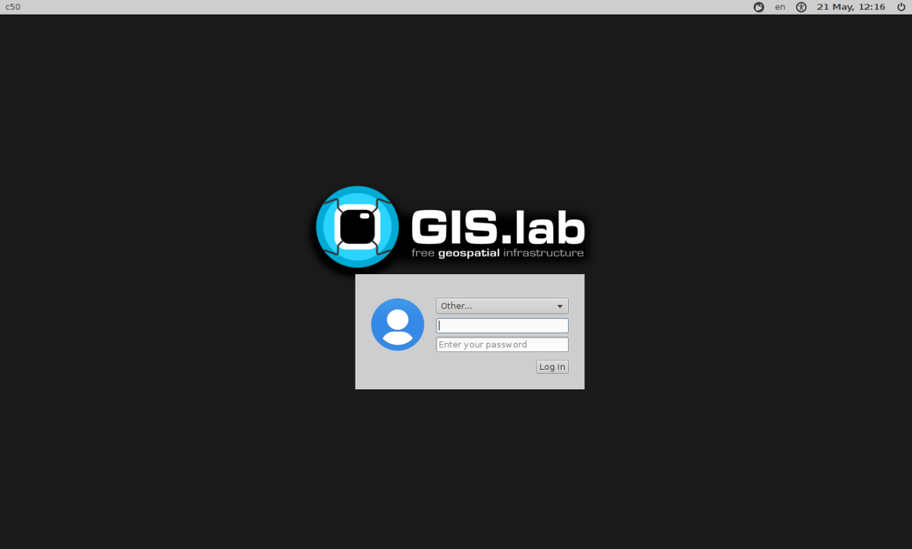

.. _installation-physical:
 
*************
Physical Mode
*************

In this section, attention shall be given to installation of GIS.lab using 
physical mode.

.. _requirements-physical:

To run GIS.lab in physical mode, there are some hardware and software requirements. 
As well as using virtual mode, :ref:`GIS.lab source code <GL-clone>` is needed. 
Information about requirements can be found below together with graphical 
figuration, see figure :num:`#requirementsphysical`. 

*Hardware*

- GIS.lab Unit machine 

  - Intel NUC, CPU Intel Core i5 Ivy Bridge DC53427HYE
  - 16 GB RAM: KINGSTON KVR16S11/8 8GB 2Rx8 1G x 64-Bit PC3-12800 CL11 204-Pin SODIMM DDR3
  -  mSata SSD 525 Series, 60GB

- 8 GB RAM on host machine, Intel NUC (optional)
- keyboard
- mouse
- LCD display
- HDMI to DVI adapter 
- networking accessories (optional)

  -  1 Gb Ethernet switch (16 ports): Netgear GS116GE
  -  CAT 5e Ethernet cables
  -  Wireless AP: Zyxel WAP3205 v2

*Software*

-  host machine running Linux or MAC OSX
-  Git, see :ref:`Git installation <git-installation>`
-  Ansible 2.0 or higher, see :ref:`Ansible installation <ansible-installation>`

.. _requirementsphysical:

.. figure:: ../img/installation/requirements-physical.svg
   :align: center
   :width: 750

   Requirements for installation in physical mode.

.. seealso:: |see| `Intel documentation <http://www.intel.com/support/motherboards/desktop/sb/CS-034249.htm>`_ and `Intel documentation for NUC hardware <http://www.intel.com/support/motherboards/desktop/sb/CS-034031.htm>`_.

.. important:: |imp| In following procedure it is assumed that GIS.lab unit 
   machine is going to be installed in network with automatic IP address 
   assigning from :ref:`DHCP server <dhcp-server>`.

======
Master
======

The process of installation consists of three main steps:

1. :ref:`Adjusted operating system installation <basic-os>`
2. :ref:`GIS.lab initialization <initialization>`
3. :ref:`GIS.lab unit installation <unit-installation>`

.. _basic-os:

.. rubric:: Adjusted operating system installation

Actual GIS.lab version runs on top of **Ubuntu 12.04 Precise** release. 
GIS.lab developers are currently working on upgrade to new Ubuntu version 
**Ubuntu 16.04 Xenial**. Meanwhile, these materials are dedicated to old 
Ubuntu version. 

Following steps will guide user to install basic Ubuntu operating system with
default ``ubuntu`` super user account and password ``ubuntu``. Network is
configured to automatically obtain :ref:`IP address <ip-address>` from 
:ref:`DHCP server <dhcp-server>`.

In the first step download latest 
`64-bit PC (AMD64) server install CD <http://releases.ubuntu.com/precise>`_ 
type of **image**.

.. _generate-ssh:

Furthermore, it is important to create **private key**. Generated public part 
of **keypair** will be used as a way to identify trusted computers 
without involving passwords. It can be generated with ``ssh-keygen`` command
from ``$HOME/.ssh`` directory. It is recommended to rename new key suitably, 
for example ``id_rsa_gislab_unit``.

Then use script ``providers/gislab-unit/gislab-unit-iso.sh`` to create 
custom **GIS.lab unit** installation **ISO image file** from original Ubuntu 
server ISO image file downloaded in above step. 
This command has some parametres `-s`, ``-t``, ``-k``, ``-w`` and ``-i``. 

.. tip:: |tip| From cloned ``gislab`` directory included in 
   :ref:`GIS.lab source code <GL-clone>` 
   run ``sudo ./providers/gislab-unit/gislab-unit-iso.sh -h`` command to see 
   details of required options. 

Options are written below. Adjusted image will be used for automatic 
installation of basic operating system on GIS.lab unit machine.

.. code:: sh

   USAGE: gislab-unit-iso.sh [OPTIONS]
   Create GIS.lab base system installation ISO image from Ubuntu Server ISO.
   Script must be executed with superuser privileges.
   
   OPTIONS
       -s country code used for choosing closest repository mirror (e.g. SK)
       -t timezone (e.g. Europe/Bratislava)
       -k SSH public key file, which will be used for GIS.lab installation or update
       -w working directory with enough disk space (2.5 x larger than ISO image size)
       -i Ubuntu Server installation ISO image file
       -h display this help

For example, assuming that downloaded original Ubuntu server installation 
``ISO image`` is located in ``Downloads`` directory, user wants to use 
``Italian`` official archive mirror, ``Rome`` timezone, ``SSH public key`` 
file particularly created for GIS.lab installation or update is located in 
``.ssh`` directory and new adjusted image should be saved in ``tmp`` directory, 
then the script can be run as follows.

.. code:: sh

   sudo ./providers/gislab-unit/gislab-unit-iso.sh -s IT -t Europe/Rome -k ~/.ssh/id_rsa_gislab_unit.pub -w /tmp/ -i ~/Downloads/ubuntu-12.04.5-server-amd64.iso

.. _installation-iso:

   Creation of custom GIS.lab unit installation ISO image.

Continue with preparation of bootable installation USB stick from custom 
GIS.lab Unit ISO image file created in previous step. On Ubuntu 
`Startup Disk Creator <https://en.wikipedia.org/wiki/Startup_Disk_Creator>`_ 
or `UNetbootin <https://en.wikipedia.org/wiki/UNetbootin>`_ application can 
be used and they exists also for other Linux distributions. 
Probably the most recommended option is usage of ``dd`` command. 
See example bellow.

.. code-block:: sh
   :emphasize-lines: 4,5,6,7

   # Format USB flash disk 
   # In is assumed that USB flash disk is connected as /dev/sdf
   # Please check 'dmesg' for your configuration
   
   # It is possible to use also gparted
   sudo mkdosfs -n 'GIS.lab Base System' -I /dev/sdf -F 32
   # isohybrid is included in syslinux
   isohybrid /path/to/your/gislab.iso
   sudo dd if=/path/to/your/gislab.iso of=/dev/sdf bs=4k
   sudo eject /dev/sdf

When above process is done, together with ready USB stick attach also power 
supply, HDMI display, keyboard and Ethernet cable into GIS.lab unit machine,
see figure :num:`#installation-unit`. 
Power it on, press ``F10`` key to run boot manager and select ``boot from USB`` 
option. Then fully automatic installation should start. When finished, 
machine will be turned of. USB stick should then be removed. 

.. _installation-unit:

.. figure:: ../img/installation/installation-unit.svg
   :align: center
   :width: 450

   Necessary hardware components in adjusted operating system installation 
   process.

.. note:: |note| After booting there is only one notification related to 
   **cash packages** that allows to choose them in case they are existing.
   Otherwise just ``Continue`` option should be selected.

As a next step, power on GIS.lab unit and log in to machine using already 
noted username ``ubuntu`` and password ``ubuntu``. 

This is one of the ways how to log in to unit and it is possible only with 
LCD monitor and keyboard connected to unit. Another way means using SSH
key and log in to unit from another computer or laptop. That is why SSH
key :ref:`was generated <generate-ssh>`.

.. important:: |imp| GIS.lab unit has to be registered in the network. In other
   words ``IP address`` has to be assigned to unit. IP address can be assigned
   only to machine which ``MAC address`` is registered. Run ``ip a`` command to 
   detect this address. 

After registration run command again and detect ``IP address`` assigned by 
DHCP server.

.. code:: sh 

   ip a | grep eth0

In case unit is not registered automatically, run DHCP client that apply for
``IP address``. Then verify working internet connection, 
e.g. with ``ping`` command. 

.. code:: sh

   sudo dhclient eth0 -v
   ping www.google.com

.. tip:: |tip| To restart network use ``sudo /etc/init.d/networking restart``
   command.

If one wants to know from his computer if unit is already in network, 
``ifconfig`` command should be run from server to see ``inet addr``. Then 
from user's computer ``ssh ubuntu@<inet addr>`` should be used to enable full 
access to unit.

.. note:: |note| Instead of ``IP address`` also assigned ``name`` of registered 
   unit should work, for example ``gislab.intra.ismaa.it``. This name can be 
   found in output of ``nslookup <ip address>`` command.

.. code:: sh

   ludka@lenovo:~$ ssh gislab@server.intra.ismaa.it.
   
      _____ _____  _____  _       _ 
     / ____|_   _|/ ____|| |     | | 
    | |  __  | | | (___  | | __ _| |__
    | | |_ | | |  \___ \ | |/ _` | '_ \ 
    | |__| |_| |_ ____) || | (_| | |_) |
     \_____|_____|_____(_)_|\__,_|_.__/   VERSION: init-1950-g1ce4a79, ID: gislab-unit-fem
   
   
   
   10 packages can be updated.
   9 updates are security updates.
   
   
   Your Hardware Enablement Stack (HWE) is supported until April 2017.
   
   Last login: Thu Apr 28 14:24:02 2016 from lenovo.intra.ismaa.it
   gislab@server.GIS.lab(gislab-unit-fem):~$ 

.. _initialization:

.. rubric:: GIS.lab initialization

GIS.lab machines are initialized from GIS.lab network using PXE or HTTP. 
This means always clean system, maintenance free with no HDD required 
using full hardware potential what make it opposite to thin client.

.. _gislab-machines:

   GIS.lab machines launching.

With regards to the recommended initialization, there are two 
important Ansible files, ``*.inventory`` file and file in ``host_vars`` 
directory which has already been stated in 
:ref:`configuration section <configuration-section>` of this documentation. 

.. _ansible-inventory-file:

Let's create Ansible inventory file. The name depends on unit's name which is 
the same as customization file in ``host_vars`` directory. For example 
``gislab-unit-italy.inventory`` will have following content:

* name of GIS.lab unit
* Ansible SSH host with IP address or name of unit
* the name of user able to log in to GIS.lab unit

Content of Ansible inventory file called ``<name-of-gislab-unit>.inventory`` 
used in physical mode would be as follows. 
 
.. code-block:: sh
   :emphasize-lines: 1
      
   <name-of-gislab-unit> ansible_ssh_host=<host-url> ansible_ssh_user=<provisioning-user-account-name>

   # Example for <gislab-unit-fem.inventory> 
   gislab-unit-fem ansible_ssh_host=10.234.1.44 ansible_ssh_user=ubuntu

Example for GIS.lab unit called ``gislab-unit-fem``, name get from ``nslookup``
command ``gislab.intra.ismaa.it`` and user ``ubuntu`` is 
``gislab-unit-fem ansible_ssh_host=gislab.intra.ismaa.it ansible_ssh_user=ubuntu``.

In the next phase ``ansible-playbook`` should be run. For more detailed 
information about playbooks, see 
`playbooks <http://docs.ansible.com/ansible/playbooks.html>`_ manual page. 
Example with above mentioned names and files is below. The execution will 
copy public part of SSH key to unit and from now, access will be possible only 
using SSH. 

.. _gislab-unit-yml:

.. figure:: ../img/installation/gislab-unit-yml.svg
   :align: center
   :width: 450

   Placement of important file for initialization in GIS.lab file layout.

.. code:: sh

   ansible-playbook --inventory=gislab-unit-fem.inventory --private-key=~/.ssh/id_rsa_gislab_unit providers/gislab-unit/gislab-unit.yml

GIS.lab unit will reboot when finished.

.. important:: |imp| Correct paths to established invetory file, newly created 
   public part of competent SSH keypair and `gislab-unit.yml` from GIS.lab 
   repository are very important. 

.. tip:: |tip| See ``gislab-unit.yml`` contect to be well aware of what this 
   script is exactly performing.

.. note:: |note| In ``providers`` directory one can find also scripts dependent
   on platform. THis is because initialization files can be different for units
   and different for `AWS <https://aws.amazon.com/>`_. 

.. _unit-installation: 

.. rubric:: GIS.lab unit installation

Once GIS.lab is configured, installation can be performed. Run following 
command to execute another ``ansible-playbook``. In this step all the work is 
made by ``gislab.yml`` file located in ``system`` directory.

.. _gislab-yml:

   Placement of important file for installation in GIS.lab file layout.

.. code:: sh

   $ ansible-playbook --inventory=gislab-unit-fem.inventory --private-key=~/.ssh/id_rsa_gislab_unit system/gislab.yml 

Now, GIS.lab unit machine is installed with GIS.lab system. Do not forget 
to :ref:`create user accounts <user-creation>` by ``gislab-adduser`` command 
and :ref:`allow their client machines <client-enabling-physical>` to connect 
by running ``gislab-machines`` command.

======
Client
======

Physical client mode is preferred way of launching GIS.lab client,
because it provides best performance. It will run GIS.lab client session
on client machine instead of original operating system installed (if
any) on hard drive. Original operating system and local data will stay
untouched and will be ready to run again after GIS.lab client is shut down.

To run physical client, it is required to connect machine running
GIS.lab server and client machines via **Gigabit switch and cables**, CAT 5e
or higher.

There is no reason to be afraid of loosing domestic operating system. 
GIS.lab client is capable to run even if you have **Windows**, **Linux** 
or **MAC OC X**. The spell is concealed in a type of machine booting.

Complete process of running GIS.lab client using physical mode, i.e. GIS.lab
unit consists of three main steps.

1. :ref:`Booting <booting-physical>`
2. :ref:`Enabling GIS.lab client on GIS.lab server <client-enabling-physical>`
3. :ref:`Running physical GIS.lab client <client-running-physical>`

.. _schema-physical-client:

   Any computer can be GIS.lab client.

.. _booting-physical:

.. rubric:: Booting

As well as in :ref:`virtual mode <booting-virtual>` it is possible to boot 
using using :ref:`PXE <pxe-boot-physical>` or :ref:`HTTP <http-boot-physical>` 
boot.

.. _pxe-boot-physical:

^^^^^^^^
PXE boot
^^^^^^^^

PXE is a method of having a client boot using only its network card. 
Using this method of booting it is possible to circumvent the normal boot 
procedure, what means booting from CD/DVD/CD-RW Drive to 
**Network Interface Card**, usually known as **NIC**.

PXE boot is a default boot mode for GIS.lab clients. Booting from PXE
requires to instruct client machine to boot from other device as it is
usually doing so. On newer computers it is also required to 
disable **Secure** boot and/or enable **Legacy** mode.

.. important:: |imp| It is necessary to enabling NIC in Bios. 

The way how to enabling NIC is going into BIOS and look for it.
It depends on machine. BIOS boot order can be changed for one time using 
``F9`` or ``F12`` key, for permanent setup from BIOS configuration using 
``DEL``,``F2`` or ``F12``, but it can differ from one to another machine brand.

It is recommended to look for *Preiferal devices*, *System Configuration*,
*Integrated Devices* or something similar and find **NIC** card there. 
When it is found, **enabled** and then back out, save and reboot should be 
selected.

In general, there are multiple possibilities how to instruct client machine to 
boot from PXE. See potential instructions below.

A. Depending on vendor, pressing some ``F`` at machine start will 
   temporary instruct machine to boot from PXE. 

B. Depending on vendor, pressing some ``F`` key at machine starts to launch boot 
   manager and enables to choose ``PXE`` or ``PCI LAN`` in boot menu to 
   boot from PXE. 

C. ``PXE`` or ``LAN`` option set as first boot device in BIOS configuration 
   enable to boot from PXE after machine restart.

.. seealso:: |see| See procedure of enabling PXE boot for 
   :ref:`Lenovo <pxe-boot-lenovo>` or :ref:`Dell <pxe-boot-dell>` machine in 
   :ref:`GIS.lab in practice <practice>` section.

   For more information about how it works see for example
   `PXE Boot Server Installation Steps in Ubuntu Server VM <http://askubuntu.com/questions/412574/pxe-boot-server-installation-steps-in-ubuntu-server-vm/414813>`.

.. _http-boot-physical:

^^^^^^^^^
HTTP boot
^^^^^^^^^

In addition to default PXE boot method, GIS.lab clients can boot over
HTTP, which can provide some advantages. 

To enable HTTP boot, it is needed to create **bootable USB stick** from
special **ISO image** which exists in **http-boot** directory.
Recipe is as follows.

Insert free USB stick into Linux workstation machine. If it is
automatically mounted, unmount it. Run ``dmesg`` command to detect
device assigned to USB stick by operating system. 

.. note:: |note| It should be something like ``/dev/sd[x]``.

Burn GIS.lab Desktop bootloader into USB stick with command below. Be careful 
to choose correct output device without a partition number.

.. code:: sh

   $ sudo dd if=http-boot/gislab-bootloader.iso of=/dev/sd[x]

Insert prepared USB stick into client machine and instruct it to boot
from it.

.. _client-enabling-physical:

.. rubric:: Enabling GIS.lab client on GIS.lab server

By default, no client machines are allowed to boot from server. To allow
client machine, there are similar steps to steps described for 
:ref:`virtual <client-enabling-virtual>` mode. Simply run 
``gislab-machines -a`` command on **GIS.lab server** and enable the client.

.. code:: sh

   sudo gislab-machines -a <MAC-address>

.. tip:: Good way to collect ``MAC addresses`` of client machines is to plainly 
   let them try to boot and than run following command to get list of denied
   MAC addresses on server.

   .. code:: sh

      $ sudo grep -e 'DHCPDISCOVER.*no free leases' /var/log/syslog 

.. _client-running-physical:

.. rubric:: Running physical GIS.lab client

After successful booting, there will be welcome screen with login dialog, see 
figure :num:`#login-unit`. Creation of user accounts and running GIS.lab clients are 
the same as in virtual mode. Find more details in 
:ref:`User accounts <user-creation>` and 
:ref:`Running virtual GIS.lab client <client-running-virtual>` sections. 

.. _login-unit:

   GIS.lab client logging in.

Enjoy!

.. _running-client-unit:

.. figure:: ../img/installation/running-client-unit.png
   :align: center
   :width: 450

   GIS.lab client running environment.

.. _gislab-upgrade:

===============================
How to upgrade GIS.lab Desktop?
===============================

GIS.lab upgrade procedure consists from three steps: 

1. server software upgrade
2. client images upgrade
3. GIS.lab system itself upgrade

Although, it is possible to run each step separately by hand, GIS.lab
provisioner is designed as idempotent task which is capable of both,
GIS.lab installation and also upgrade. This means, that GIS.lab upgrade
is performed by the same provisioner command as used for GIS.lab
installation. Using GIS.lab provisioner for upgrade is recommended to
keep all parts of GIS.lab in consistent state.

GIS.lab source code update: 

.. code-block:: sh

   $ git pull

Upgrade with Ansible:

.. code-block:: sh

   $ ansible-playbook --inventory=gislab-unit.inventory --private-key=<private-SSH-key-file> system/gislab.yml
