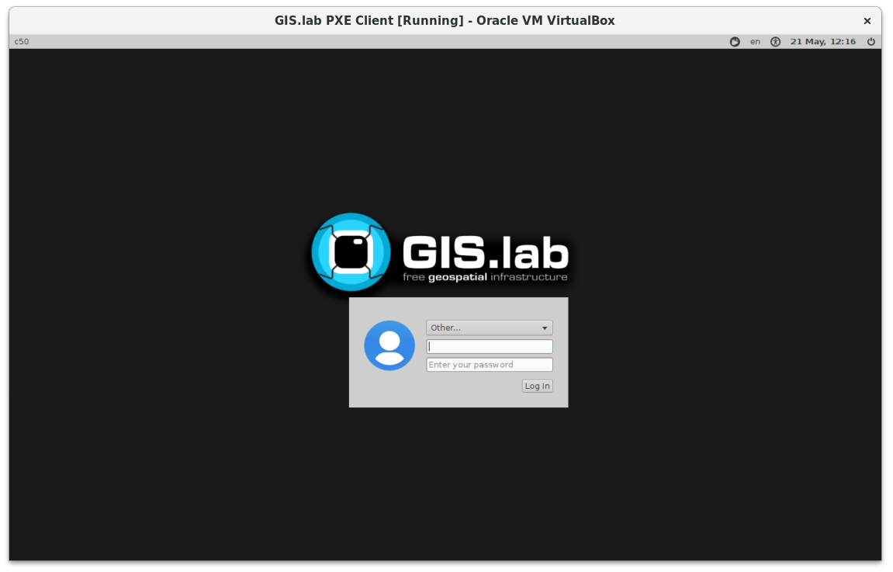

.. _installation-virtual:
 
************
Virtual Mode
************

This part describes installation of GIS.lab in virtual machine using Vagrant 
and VirtualBox. Only **Linux** and **MAC OS X** operating systems are supported. 
Installation process will NOT modify anything on your host machine. Every 
operation is done inside of virtual machine.

GIS.lab server contains its own DHCP server. DHCP server is used in almost every 
local network for automatic network configuration. By default, access to GIS.lab's 
DHCP server is restricted only for GIS.lab client machines (by list of their 
MAC addresses) and it is managed by ``gislab-machines`` administrator command. 
It is possible to switch access policy to unrestricted, but it is required to 
double check that no DHCP servers conflict will occur. 
Otherwise, serious network breakage may be done. 

.. attention:: |att| Please, never change policy to unrestricted when connecting 
   to your corporate LAN!

GIS.lab creates it's own network. By default it is in range ``192.168.50.0/24``. 
If this range already exists in LAN where GIS.lab is going to be deployed, 
it is required to change it using ``GISLAB_NETWORK`` configuration variable.

See :ref:`Configuration section <configuration-section>` for information 
about changing GIS.lab configuration. 

.. important:: |imp| Without changing network configuration variable IP 
   conflicts may occur. 

.. _requirements-virtual:
   
To run GIS.lab in Virtual mode, there are some hardware and software requirements. 
Another important point is GIS.lab source code, see :ref:`GIS.lab source code download <GL-clone>`. 
See information below with graphical representation in figure
:num:`#requirementsvirtual`. 

*Hardware*

- 4 GB RAM on host machine

*Software*

-  host machine running Linux or MAC OSX
-  Git, see :ref:`Git installation <git-installation>`
-  Ansible 2.0 or higher, see :ref:`Ansible installation <ansible-installation>`
-  VirtualBox 4.3 or higher, see :ref:`VirtualBox installation <vb-installation>`
-  Vagrant 1.7 or higher , see :ref:`Vagrant installation <vagrant-installation>`

.. _requirementsvirtual:

.. figure:: ../img/installation/requirements-virtual.svg
   :align: center
   :width: 450

   Requirements for installation in virtual mode.

.. tip:: |tip| Check the version of software that are installed by typing

   .. code:: sh

      $ ansible --version
      $ vboxmanage --version
      $ vagrant --version

.. note:: |note| Git is not necessary but it is recommended. One can get 
   GIS.lab source code also by downloading latest GIS.lab package from
   `https://github.com/gislab-npo/gislab.git <https://github.com/gislab-npo/gislab.git>`_ and unpacking it in working directory.

======
Master
======

GIS.lab installation takes from 30 minutes to few hours depending on
your machine performance and Internet connection speed.

Run following command in source code directory to power on the Virtual Machine.
Everey time ``up`` command is used, ``Vagrantfile`` will is used for 
configuration. If the ``up`` command is run first time, it also run the 
``vagrant provision`` command internally used to provision, i.e. install and 
configure software. 

.. code:: sh

   $ vagrant up

The output should be as follows.

.. code:: sh

   Bringing machine 'gislab_vagrant' up with 'virtualbox' provider...
   ==> gislab_vagrant: Clearing any previously set forwarded ports...
   ==> gislab_vagrant: Clearing any previously set network interfaces...
   ==> gislab_vagrant: Available bridged network interfaces:
   1) eth0
   2) wlan0
   ==> gislab_vagrant: When choosing an interface, it is usually the one that is
   ==> gislab_vagrant: being used to connect to the internet.
       gislab_vagrant: Which interface should the network bridge to? 

If machine contains multiple network adapters, user is asked to choose one 
corresponding adapter. For example, in case of ``eth0`` connection, selection 
``2`` should be choosen. Then the installation goes ahead.

.. code:: sh

   ==> gislab_vagrant: Preparing network interfaces based on configuration...
       gislab_vagrant: Adapter 1: nat
       gislab_vagrant: Adapter 2: bridged
   ==> gislab_vagrant: Forwarding ports...
       gislab_vagrant: 22 => 2222 (adapter 1)
   ==> gislab_vagrant: Running 'pre-boot' VM customizations...
   ==> gislab_vagrant: Booting VM...
   ==> gislab_vagrant: Waiting for machine to boot. This may take a few minutes...
       gislab_vagrant: SSH address: 127.0.0.1:2222
       gislab_vagrant: SSH username: vagrant
       gislab_vagrant: SSH auth method: private key
       gislab_vagrant: Warning: Connection timeout. Retrying...
   ==> gislab_vagrant: Machine booted and ready!
   ==> gislab_vagrant: Checking for guest additions in VM...
       gislab_vagrant: The guest additions on this VM do not match the installed version of
       gislab_vagrant: VirtualBox! In most cases this is fine, but in rare cases it can
       gislab_vagrant: prevent things such as shared folders from working properly. If you see
       gislab_vagrant: shared folder errors, please make sure the guest additions within the
       gislab_vagrant: virtual machine match the version of VirtualBox you have installed on
       gislab_vagrant: your host and reload your VM.
       gislab_vagrant: 
       gislab_vagrant: Guest Additions Version: 4.1.44
       gislab_vagrant: VirtualBox Version: 4.3
   ==> gislab_vagrant: Configuring and enabling network interfaces...
   ==> gislab_vagrant: Machine already provisioned. Run `vagrant provision` or use the `--provision`
   ==> gislab_vagrant: flag to force provisioning. Provisioners marked to run always will still run.

-------------
User accounts
-------------

GIS.lab user accounts are created by GIS.lab administrator on demand. 
The same login credentials are valid for logging in to GIS.lab client session 
and to all GIS.lab services as well.

By default, GIS.lab installation creates only a superuser account ``gislab``. 
Ordinary user account can be created by logging in to GIS.lab server, i.e. 
running Vagrant machine in source code directory via SSH.

.. _vagrant-login:

Any IP address, username or password are not needed to login via ``SSH``. 
Just ``vagrant ssh`` command is enough. The only obligation is to be present 
in the folder where ``Vagrantfile`` is. That file contains all necessary information.

.. code:: sh

   $ vagrant ssh

.. _user-creation:

For example ``lab1`` user account with password ``lab`` can then be created by 
using ``gislab-adduser`` command.

.. code:: sh 

   $ sudo gislab-adduser -g User -l GIS.lab -m lab1@gis.lab -p lab lab1

With ``gislab-listusers`` list of all GIS.lab users is displayed, see example below.

.. code:: sh

.. code::
	
   $ sudo gislab-listusers | grep uid:
   uid: uid=gislab
   uid: uid=lab1

   $ sudo gislab-adduser -g User -l GIS.lab -m furtkevicova@gis.lab -p ludmila furtkevicova
   
   $ sudo gislab-listusers | grep dn:
   uid: uid=gislab
   uid: uid=lab1
   uid: uid=furtkevicova

======
Client
======

Running GIS.lab client in virtual mode is very useful when one wants to
keep working in his favourite operating system, e.g. Windows 7 OS but also wants 
to use GIS.lab environment.
GIS.lab virtual client is running in VirtualBox virtual machine, which
is capable to run on **Windows**, **Linux** or **Mac OS X** operating systems.
The process consists of four main steps: 

1. :ref:`Virtual machine creation <vm-creation>`
2. :ref:`Booting <booting-virtual>`
3. :ref:`Enabling GIS.lab client on GIS.lab server <client-enabling-virtual>`
4. :ref:`Running virtual GIS.lab client <client-running-virtual>`

.. _schema-virtual-client:

   Computer with various operating system can be GIS.lab client.

.. _vm-creation:

.. rubric:: Virtual machine creation

Machines are created in VirtualBox environment and their creation depends on 
type of booting, see figures :num:`#pxe-vb-settings` and :num:`#http-vb-settings`. 

.. _booting-virtual:

.. rubric:: Booting

It is possible to boot using :ref:`PXE <pxe-boot-virtual>` or 
:ref:`HTTP <http-boot-virtual>` boot. 

.. _pxe-boot-virtual:

--------
PXE boot
--------

PXE boot is a default boot mode for GIS.lab clients. It is a simplest
method to get client up and running, but it may not work if
multiple DHCP boot servers or GIS.lab servers exists in network.

It is necessary to configure boot order to boot only **from network**, enable IO APIC, 
configure network adapter in bridged mode, make sure that ``PCnet-FAST III (Am79C973)`` 
is selected as the adapter type and allow promiscuous mode for all. 

.. _pxe-vb-settings:

.. figure:: ../img/installation/pxe-vb-settings.png
   :align: center
   :width: 750

   Settings in VirtalBox using PXE boot.

.. _http-boot-virtual:

---------
HTTP boot
---------

HTTP boot is an alternative boot method for launching GIS.lab Desktop
clients, which offers some advanced features and allows to boot if
multiple DHCP boot servers or GIS.lab servers exists in LAN. HTTP boot is 
performed by loading 
system from special GIS.lab bootloader **ISO image file**, which exists 
in *http-boot/gislab-bootloader.iso*. Here is a
list of notable advantages of HTTP boot over PXE:

-  it is the only way to boot if multiple DHCP boot servers or GIS.lab
   servers exists in network
-  it allows to manually choose target GIS.lab server which is very
   handy if multiple GIS.lab servers are running in one network
-  it is easier to boot from HTTP (which is actually done by booting
   from USB stick) than to setup PXE boot on some new machines
-  boot process is faster
-  it allows to use para-virtualized network adapter for Virtual clients
   (VirtualBox), which is many times faster than network adapter used
   for PXE

Using HTTP boot it is necessary to add virtual *gislab-bootloader.iso* file as 
virtual CD/DVD, configure boot order to boot only from virtual CD/DVD, enable *IO
APIC*, configure network adapter in bridged mode, make sure 
``Paravirtualized Network (virtio-net)`` is selected as the adapter type and allow
promiscuous mode for all.

.. _http-vb-settings:

.. figure:: ../img/installation/http-vb-settings.png
   :align: center
   :width: 750

   Settings in VirtalBox using HTTP boot.

.. important:: |imp| For next steps assigned ``MAC address`` is needed. 
   See *Network* section in VirtualBox environment and make a note of this 
   address.

Selection of the network adapter on the host system that traffic to and from 
which network card will go through should be different from current internet 
connection, e.g. in case of ``wlan0``, ``eth0`` should be set as ``Name`` 
of ``Bridged Adapter``.

.. _client-enabling-virtual:

.. rubric:: Enabling GIS.lab client on GIS.lab server

After virtual client is created, log in to GIS.lab server and with 
``gislab-machines -a`` allow client machine to connect.

.. code:: sh

   $ vagrant ssh
   $ sudo gislab-machines -a <MAC-address>

.. _client-running-virtual:

.. rubric:: Running virtual GIS.lab client

Start GIS.lab client virtual machine by pressing ``Start`` button in
VirtualBox Manager, log in and enjoy. 

.. figure:: ../img/installation/client-vb-launching.png
   :align: center
   :width: 450

   GIS.lab virtual client launching.

.. note:: |note| Make sure that GIS.lab Master is running.

   .. code:: sh

      $ vagrant status
      Current machine states:
      
      gislab_vagrant            running (virtualbox)
      
      The VM is running. To stop this VM, you can run `vagrant halt` to
      shut it down forcefully, or you can run `vagrant suspend` to simply
      suspend the virtual machine. In either case, to restart it again,
      simply run `vagrant up`.

In the figures :num:`#client-pxe-logging-in` 
and :num:`#client-pxe-running` one can see GIS.lab client logging in screen 
and Desktop of running virtual GIS.lab client using e.g. PXE boot.

.. _client-pxe-logging-in:

   GIS.lab client logging in.

.. _client-pxe-running:

.. figure:: ../img/installation/client-pxe-running.png
   :align: center
   :width: 450

   GIS.lab client running environment.

Using HTTP boot there are two possible choices to choose from: 

A) :ref:`Automatic GIS.lab detection <automatic-detection>`
B) :ref:`Manual GIS.lab selection <manual-selection>`.

.. _automatic-detection:

.. rubric:: Automatic detection

This mode will run DHCP request to set initial network DNS server
configuration. It will use the first response from any DHCP server in
network. Then, it will try to boot from ``http://boot.gis.lab``. It means,
that if DHCP server response was from GIS.lab server, client machine
will successfully launch. If that response was from some third-party
DHCP server running in LAN, it will fail unless DNS server provided by
that DHCP response will be aware of ``boot.gis.lab``. It also means, that
if multiple GIS.lab server instances are running in one LAN, it is not
possible to predict which one will be used.

.. _http-boot-a:

.. figure:: ../img/installation/http-boot-menu.png
   :align: center
   :width: 450

   Automatic detection using HTTP boot.

.. _manual-selection:

.. rubric:: Manual selection

Manual GIS.lab server selection can be used to choose GIS.lab server by
entering its IP address. It means, that it is not vulnerable from
third-party DHCP responses and it is possible to choose particular
GIS.lab server, if multiple ones are running in LAN. GIS.lab server is
using multiple IP addresses, i.e. IP address from GIS.lab network range
``GISLAB_NETWORK.5`` or IP address assigned by LAN. Both of them can be
used for choosing GIS.lab server to boot.

.. _http-boot-m:

   Manual network selection using HTTP boot.

IP address can be found out after typing ``ip a | grep eth0`` on GIS.lab server 
after ``vagrant ssh`` command.

.. tip:: |tip| To set custom client display resolution run following command 
   on host machine.
   
   .. code:: sh
      
      $ VBoxManage controlvm "<GIS.lab client name>" setvideomodehint <xresolution> <yresolution> 32
      # example 
      $ VBoxManage controlvm "GIS.lab client PXE" setvideomodehint 1000 660 32

.. note:: |note| Getting a list of all running VirtualBox virtual machines by 
   name and UUID is possible with following command on host machine.

   .. code:: sh

      $ VBoxManage list runningvms

For logging out from GIS.lab server use ``logout`` and then use ``vagrant halt``
to shut down the running machine Vagrant is managing. It does not remove the 
Virtual Machine from the hard disk. Machine can be started again by using 
``vagrant up`` command. 

.. tip:: |tip| Use ``-f`` or ``-force`` flag to forcefully power off the Virtual 
   Machine. 

===============================
How to upgrade GIS.lab Desktop?
===============================

GIS.lab upgrade procedure consists from three steps: 

1. server software upgrade
2. client images upgrade
3. GIS.lab system itself upgrade

Although, it is possible to run each step separately by hand, GIS.lab
provisioner is designed as idempotent task which is capable of both,
GIS.lab installation and also upgrade. This means, that GIS.lab upgrade
is performed by the same provisioner command as used for GIS.lab
installation. Using GIS.lab provisioner for upgrade is recommended to
keep all parts of GIS.lab in consistent state.

GIS.lab source code update: 

.. code-block:: sh

   $ git pull

Upgrade with Vagrant:

.. code-block:: sh

   $ vagrant provision
