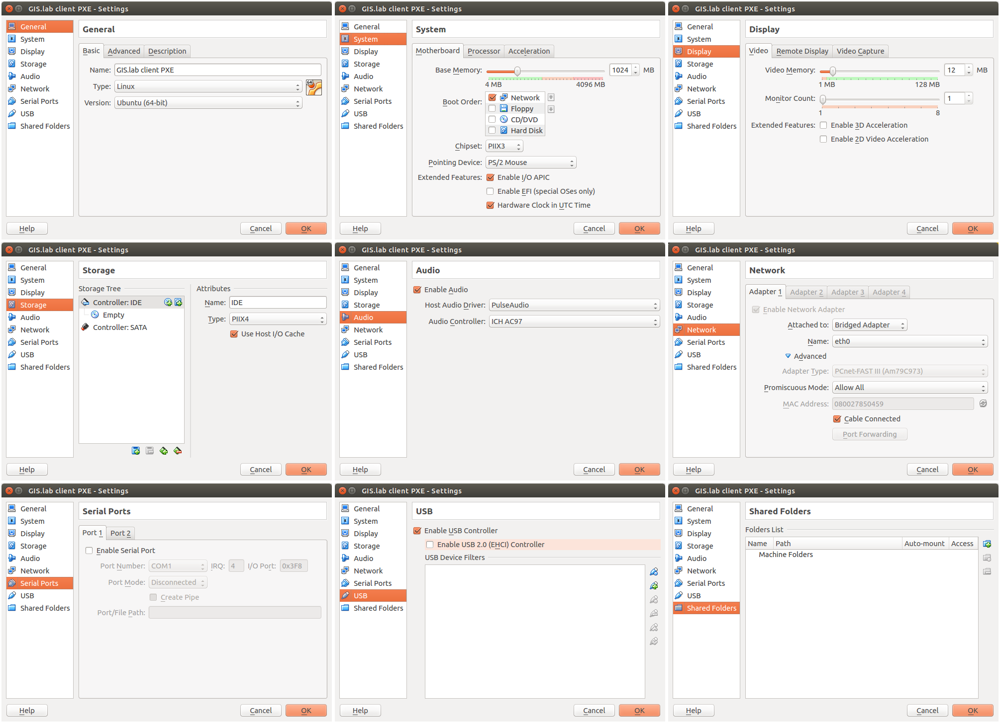
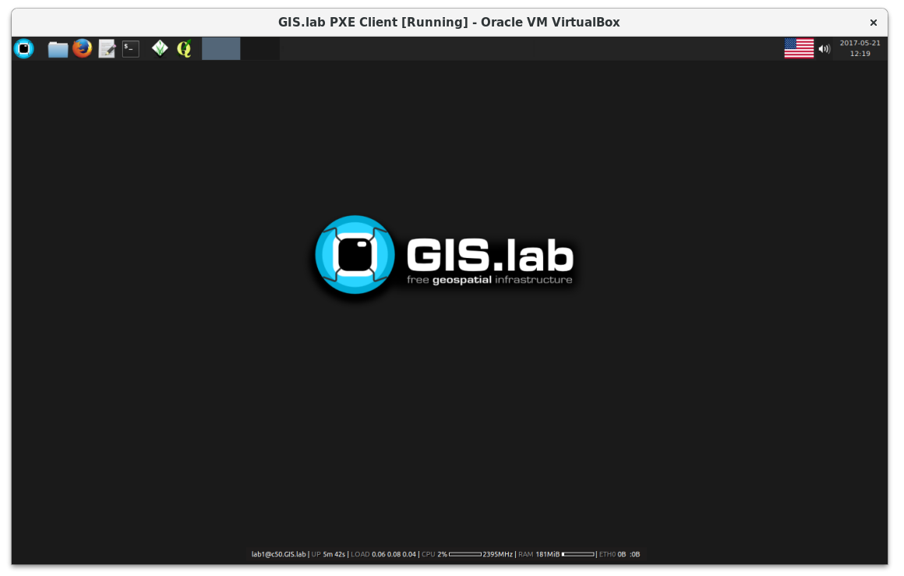

************
Virtual Mode
************

This part describes installation of GIS.lab in virtual machine using
Vagrant and VirtualBox. Only **Linux** and **MAC OS X** operating
systems on host machine are supported.  Installation process will NOT
modify anything on your host machine. Every operation is done inside
of virtual machine.

GIS.lab server contains its own DHCP server which is by default
disabled. DHCP server is used in almost every local network for
automatic network configuration. If there is no DHCP server in your
network configurated to support GIS.lab (it's typical situation in
Virtual mode), own DHCP server on GIS.lab server must be enabled
otherwise GIS.lab clients will not able to boot. GIS.lab DHCP server
can be controlled by ``gislab-network`` administrator command, see
:ref:`installation process <gislab-network>` for details. By default,
access to GIS.lab's DHCP server is restricted only for GIS.lab client
machines (by list of their MAC addresses) and it is managed by
``gislab-machines`` administrator command.  It is possible to switch
access policy to accept all clients, but it is required to double
check that no DHCP servers conflict will occur. Otherwise, serious
network breakage may be done.

.. attention:: |att| Please, never change policy to allow all clients
   when connecting to your corporate LAN! It's also recommended in
   this case to use corporate DHCP server (and keep GIS.lab DHCP
   server disabled, see :ref:`network-management` section for
   details).

If DHCP server on GIS.lab is enabled than own network is created. By
default it is in range ``192.168.50.0/24``.  If this range already
exists in LAN where GIS.lab is going to be deployed, it is required to
change it using ``GISLAB_NETWORK`` configuration variable.

See :ref:`Configuration section <configuration-section>` for more
information.

.. important:: |imp| Without changing network configuration variable IP 
   conflicts may occur. 

.. _requirements-virtual:
   
To run GIS.lab in Virtual mode, there are some hardware and software
requirements.  Another important point is GIS.lab source code, see
:ref:`GIS.lab source code download <GL-clone>`.  See information below
with graphical representation in :num:`#requirementsvirtual`.

*Hardware*

- at least 4 GB RAM on host machine

*Software*

-  host machine running Linux or MAC OSX
-  Git, see :ref:`Git installation <git-installation>`
-  Ansible 2.0 or higher, see :ref:`Ansible installation <ansible-installation>`
-  VirtualBox 4.3 or higher, see :ref:`VirtualBox installation <vb-installation>`
-  Vagrant 1.9 or higher, see :ref:`Vagrant installation <vagrant-installation>`

.. _requirementsvirtual:

   Requirements for installation in virtual mode.

.. tip:: |tip| Check the version of software that are installed by typing

   .. code:: sh

      $ ansible --version
      $ vboxmanage --version
      $ vagrant --version

======
Master
======

GIS.lab installation takes from 30 minutes to few hours depending on
your machine performance and Internet connection speed.

Run following command in source code directory to power on the Virtual
Machine providing GIS.lab master (server).

.. code:: sh

   $ vagrant up

Everytime ``up`` command is performed, ``Vagrantfile`` will
be used for configuration of virtual machine. If the ``up`` command is
run first time, it also run the ``provision`` command internally used
to provision, i.e. install and configure a virtual machine.

The output should be as follows.

.. code:: sh

   Bringing machine 'gislab_vagrant' up with 'virtualbox' provider...
   ==> gislab_vagrant: Importing base box 'xenial-canonical'...
   ==> gislab_vagrant: Matching MAC address for NAT networking...
   ==> gislab_vagrant: Setting the name of the VM: gislab-vagrant-xenial
   ==> gislab_vagrant: Clearing any previously set network interfaces...
   ==> gislab_vagrant: Available bridged network interfaces:
   1) wlan0
   2) eth0
   3) docker0
   ==> gislab_vagrant: When choosing an interface, it is usually the one that is
   ==> gislab_vagrant: being used to connect to the internet.
       gislab_vagrant: Which interface should the network bridge to? 

If host machine contains multiple network adapters, user is asked to
choose one corresponding adapter. For example, in case of ``eth0``
connection, selection ``2`` should be choosen. Then the installation
goes ahead.

.. tip::

   |tip| Typically choose network interface which is NOT currently
   used for Internet connection.
   
.. code:: sh

   ==> gislab_vagrant: Preparing network interfaces based on configuration...
       gislab_vagrant: Adapter 1: nat
       gislab_vagrant: Adapter 2: bridged
   ==> gislab_vagrant: Forwarding ports...
       gislab_vagrant: 22 (guest) => 2222 (host) (adapter 1)
   ==> gislab_vagrant: Running 'pre-boot' VM customizations...
   ==> gislab_vagrant: Booting VM...
   ==> gislab_vagrant: Waiting for machine to boot. This may take a few minutes...
       gislab_vagrant: SSH address: 127.0.0.1:2222
       gislab_vagrant: SSH username: ubuntu
       gislab_vagrant: SSH auth method: password
   ==> gislab_vagrant: Machine booted and ready!
   ==> gislab_vagrant: Checking for guest additions in VM...
       ...
       gislab_vagrant: 
       gislab_vagrant: Guest Additions Version: 5.0.18_Ubuntu r106667
       gislab_vagrant: VirtualBox Version: 5.1
   ==> gislab_vagrant: Configuring and enabling network interfaces...
   ==> gislab_vagrant: Running provisioner: install (ansible)...
       gislab_vagrant: Running ansible-playbook...
       [WARNING]: Not prompting as we are not in interactive mode

   PLAY [all] *********************************************************************

   TASK [installation-setup : Ensure Python 2 is installed before running Ansible modules] ***
   changed: [gislab_vagrant]

   ...

   TASK [installation-done : Installation of GIS.lab is done] *********************
   changed: [gislab_vagrant]

   PLAY RECAP *********************************************************************
   gislab_vagrant             : ok=426  changed=368  unreachable=0    failed=0   

-------------
User accounts
-------------

GIS.lab user accounts are created by administrator on demand. Due to
`LDAP
<https://en.wikipedia.org/wiki/Lightweight_Directory_Access_Protocol>`__
integration the same login credentials are valid for logging in to
GIS.lab client session and to all GIS.lab services as well.

By default, GIS.lab installation creates only a superuser account ``gislab``. 
Ordinary user account can be created by logging in to GIS.lab server, i.e. 
running Vagrant machine in source code directory via SSH.

.. _vagrant-login:

Any IP address, username or password are not needed to login via SSH.
Just ``vagrant ssh`` command is enough. The only obligation is to be
present in the folder where ``Vagrantfile`` is. That file contains all
necessary information.

.. code:: sh

   $ vagrant ssh

A new user account can be created by ``gislab-adduser`` administration
command. See :ref:`user-creation` section for details.
   
======
Client
======

Running GIS.lab client in virtual mode is very useful when one wants to
keep working in his favourite operating system, e.g. Windows 7 OS but also wants 
to use GIS.lab environment.
GIS.lab virtual client is running in VirtualBox virtual machine, which
is capable to run on **Windows**, **Linux** or **Mac OS X** operating systems.
The process consists of four main steps: 

1. :ref:`Virtual machine creation <vm-creation>`
2. :ref:`Booting <booting-virtual>`
3. :ref:`Enabling GIS.lab client on GIS.lab server <client-enabling>`
4. :ref:`Running virtual GIS.lab client <client-running-virtual>`

.. _schema-virtual-client:

.. figure:: ../img/installation/schema-virtual-client.png
   :align: center
   :width: 450

   Computer with various operating system can be GIS.lab client.

.. _vm-creation:

.. rubric:: Virtual machine creation

Machines are created in VirtualBox environment and their creation depends on 
type of booting, see :num:`#pxe-vb-settings` and :num:`#http-vb-settings`. 

.. _booting-virtual:

.. rubric:: Booting

There are two options how to boot GIS.lab Desktop clients either using
:ref:`PXE <pxe-boot-virtual>` or :ref:`HTTP <http-boot-virtual>` boot.

.. _pxe-boot-virtual:

--------
PXE boot
--------

PXE boot is a default boot mode for GIS.lab clients. It is a simplest
method to get client up and running, but it may not work if multiple
DHCP boot servers or GIS.lab servers exists in network.

It is necessary to configure boot order to boot only **from network**,
enable IO APIC, configure network adapter in bridged mode, make sure
that ``PCnet-FAST III (Am79C973)`` is selected as the adapter type and
allow promiscuous mode for all.

.. _pxe-vb-settings:

   Settings in VirtalBox using PXE boot.

.. _http-boot-virtual:

---------
HTTP boot
---------

HTTP boot is an alternative boot method for launching GIS.lab Desktop
clients, which offers some advanced features and allows to boot if
multiple DHCP boot servers or GIS.lab servers exists in LAN. HTTP boot is 
performed by loading 
system from special GIS.lab bootloader **ISO image file**, which exists 
in :file:`http-boot/gislab-bootloader.iso`. Here is a
list of notable advantages of HTTP boot over PXE:

-  it is the only way to boot if multiple DHCP boot servers or GIS.lab
   servers exists in network
-  it allows to manually choose target GIS.lab server which is very
   handy if multiple GIS.lab servers are running in one network
-  it is easier to boot from HTTP (which is actually done by booting
   from USB stick) than to setup PXE boot on some new machines
-  boot process is faster
-  it allows to use para-virtualized network adapter for Virtual clients
   (VirtualBox), which is many times faster than network adapter used
   for PXE

Using HTTP boot it is necessary to add virtual :file:`gislab-bootloader.iso` file as 
virtual CD/DVD, configure boot order to boot only from virtual CD/DVD, enable *IO
APIC*, configure network adapter in bridged mode, make sure 
``Paravirtualized Network (virtio-net)`` is selected as the adapter type and allow
promiscuous mode for all.

.. _http-vb-settings:

   Settings in VirtalBox using HTTP boot.

.. important:: |imp| For next steps assigned ``MAC address`` is needed. 
   See *Network* section in VirtualBox environment and make a note of this 
   address.

Selection of the network adapter on the host system that traffic to and from 
which network card will go through should be different from current internet 
connection, e.g. in case of ``wlan0``, ``eth0`` should be set as ``Name`` 
of ``Bridged Adapter``.

After virtual client is created, log in to GIS.lab server (``vagrant
ssh``) and with ``gislab-machines`` administration command allow
client machine to connect, see :ref:`client-enabling` section for details.

.. _gislab-network:
   
.. important:: |imp| Since GIS.lab version 0.6 DHCP service is
   disabled by default. In order to boot virtual client DHCP service
   must be running. See :ref:`network-management` section for details.
               
.. _client-running-virtual:

.. rubric:: Running virtual GIS.lab client

Start GIS.lab client virtual machine by pressing ``Start`` button in
VirtualBox Manager, log in and enjoy. 

   GIS.lab virtual client launching.

.. note:: |note| Make sure that GIS.lab master (server) is running.

   .. code:: sh

      $ vagrant status
      Current machine states:
      
      gislab_vagrant            running (virtualbox)
      
Using HTTP boot there are two possible choices to choose from: 

A) :ref:`Automatic GIS.lab detection <automatic-detection>`
B) :ref:`Manual GIS.lab selection <manual-selection>`.

.. _automatic-detection:

.. rubric:: Automatic detection

This mode will run DHCP request to set initial network DNS server
configuration. It will use the first response from any DHCP server in
network. Then, it will try to boot from ``http://boot.gis.lab``. It means,
that if DHCP server response was from GIS.lab server, client machine
will successfully launch. If that response was from some third-party
DHCP server running in LAN, it will fail unless DNS server provided by
that DHCP response will be aware of ``boot.gis.lab``. It also means, that
if multiple GIS.lab server instances are running in one LAN, it is not
possible to predict which one will be used.

.. _http-boot-a:

   Automatic detection using HTTP boot.

.. _manual-selection:

.. rubric:: Manual selection

Manual GIS.lab server selection can be used to choose GIS.lab server by
entering its IP address. It means, that it is not vulnerable from
third-party DHCP responses and it is possible to choose particular
GIS.lab server, if multiple ones are running in LAN. GIS.lab server is
using multiple IP addresses, i.e. IP address from GIS.lab network range
``GISLAB_NETWORK.5`` or IP address assigned by LAN. Both of them can be
used for choosing GIS.lab server to boot.

.. _http-boot-m:

.. figure:: ../img/installation/http-boot-network-selection.png
   :align: center
   :width: 450

   Manual network selection using HTTP boot.

.. tip::
      
   |tip| IP address can be found out after typing ``ip a | grep eth0``
   on GIS.lab server after log in by ``vagrant ssh`` command.

In :num:`#client-pxe-logging-in` and :num:`#client-pxe-running` one
can see GIS.lab client logging screen and Desktop of running
virtual GIS.lab client.

.. _client-pxe-logging-in:

.. figure:: ../img/installation/client-pxe-logging-in.png
   :align: center
   :width: 450

   GIS.lab client logging screen.

.. _client-pxe-running:

   GIS.lab client running environment.

.. tip:: |tip| To set custom client display resolution run following command 
   on host machine.
   
   .. code:: sh
      
      $ VBoxManage controlvm "<GIS.lab client name>" setvideomodehint <xresolution> <yresolution> 32
      # For example 
      $ VBoxManage controlvm "GIS.lab client PXE" setvideomodehint 1000 660 32

.. note:: |note| Getting a list of all running VirtualBox virtual machines by 
   name and UUID is possible with following command on host machine.

   .. code:: sh

      $ VBoxManage list runningvms

For logging out from GIS.lab server use ``logout`` and then use
``vagrant halt`` to shut down the running machine Vagrant is
managing. It does not remove the Virtual Machine from the hard
disk. Machine (GIS.lab master/server) can be started again by using
``vagrant up`` command.

.. tip:: |tip| Use ``-f`` or ``-force`` flag to forcefully power off the Virtual 
   Machine. 

.. note:: |note| GIS.lab master virtual machine can be deleted by:

   .. code:: sh

      $ vagrant -f destroy

.. _gislab-upgrade-virtual:
      
=======================
How to upgrade GIS.lab?
=======================

GIS.lab upgrade procedure consists from three steps: 

1. server software upgrade
2. client images upgrade
3. GIS.lab system itself upgrade

Although, it is possible to run each step separately by hand, GIS.lab
provisioner is designed as idempotent task which is capable of both,
GIS.lab installation and also upgrade. This means, that GIS.lab upgrade
is performed by the same provisioner command as used for GIS.lab
installation. Using GIS.lab provisioner for upgrade is recommended to
keep all parts of GIS.lab in consistent state.

In GIS.lab source code directory run: 

.. code-block:: sh

   $ git pull

And upgrade GIS.lab master (server) virtual machine with Vagrant:

.. code-block:: sh

   $ vagrant provision

.. note::

   |note| Note that virtual machine must be running when performing provisioning.
