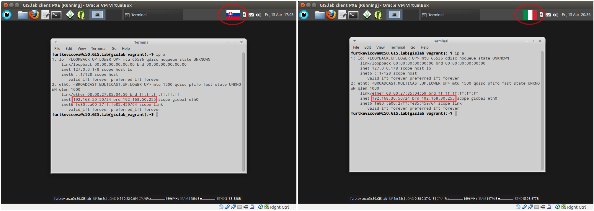

.. _example-configuration:

=============================
Example of configuration file
=============================

Example configuration in ``gislab_vagrant`` or ``<name-of-gislab-unit>``
file is shown below.

.. code-block:: sh
   :emphasize-lines: 5

   GISLAB_ADMIN_FIRST_NAME: Ludmila
   GISLAB_ADMIN_SURNAME: Furtkevicova
   GISLAB_ADMIN_EMAIL: ludmilafurtkevicov@gmail.com

   GISLAB_NETWORK: 192.168.50
   GISLAB_TIMEZONE: Europe/Rome
   GISLAB_DNS_SERVERS:
    - 10.234.10.10
    - 8.8.8.8
   
   GISLAB_CLIENT_ARCHITECTURE: amd64
   GISLAB_CLIENT_LANGUAGES:
    - en
    - sk
    - it
   
   GISLAB_CLIENT_KEYBOARDS:
     - layout: en
       variant: qwerty
     - layout: sk
       variant: qwerty
     - layout: it
       variant: qwerty
   
   GISLAB_CLIENT_OWS_WORKER_MIN_MEMORY: 4000

Let's see practical example of configuration with 
some changes related to GIS.lab network and client keyboards in virtual mode.
Variables ``GISLAB_NETWORK`` and ``GISLAB_CLIENT_KEYBOARDS`` in ``gislab_vagrant``
file will be different. Results after the successful installation for both cases 
are in figure :num:`#config-virtual`.

.. tip:: |tip| See :doc:`Installation in Virtual Mode <../installation/virtual>`
   section for more details about the steps or just use ``vagrant provision``
   command which is used to install and configure the machine Vagrant is managing .

.. code:: sh

   file gislab_vagrant 'A'                        file gislab_vagrant 'B'
   -----------------------                        ----------------------- 
   GISLAB_NETWORK: 192.168.50                     GISLAB_NETWORK: 192.168.30
                                 
   GISLAB_CLIENT_KEYBOARDS:                       GISLAB_CLIENT_KEYBOARDS:
   - layout: sk                                   - layout: it
     variant: qwerty                                variant: qwerty

.. _config-virtual:

   Two different results using different Vagrant configuration file.

Fourth number of server's IP address will always be ``5`` and the first client's 
IP address will always terminate with ``50``. For left case of figure 
:num:`#config-virtual` these addresses would look like ``192.168.50.5`` and 
``192.168.50.50``.

.. note:: |note| This information is useful in manual GIS.lab server selection  
          using :ref:`HTTP boot <http-boot-virtual>` when server's IP address is required.

.. _example-gdal:

