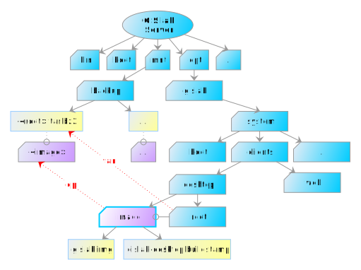
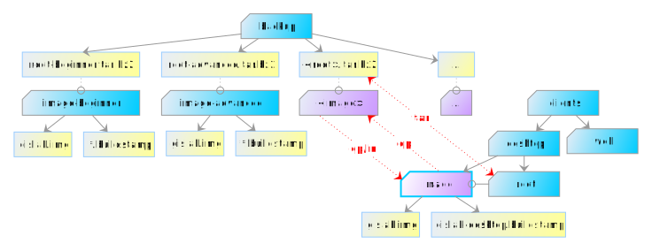

.. _gislab-customization:
 
*************
Customization
*************

When talking about customization, we should distinguish between:

1. :ref:`Server customization <server-customization>`
2. :ref:`User accounts customization <user-customization>`
3. :ref:`Client customization <client-customization>`

.. _server-customization:

====================
Server customization
====================

GIS.lab Server (master node) can be customized by running standard
Linux/Ubuntu commands. See `GISMentors training group customization
<https://github.com/GISMentors/gislab-customization>`__ for example of
customization performed by specific Ansible Playbooks.
             
But it is recommended to use some isolated environment like `LXC
<https://linuxcontainers.org/lxc/introduction/>`_ or `Docker
<https://www.docker.com/>`_ containers when deploying custom
service. See :doc:`Gisquick integration <../gisquick/docker>` section
for example of such customization.

.. seealso:: |see| `Understanding the key differences between LXC and
             Docker <https://www.flockport.com/lxc-vs-docker/>`_

.. _user-customization:

===========================
User accounts customization
===========================

Process of creation and removal of GIS.lab user accounts can be
customized by special scripts. 

.. important:: |imp| Scripts must have executable permissions assigned and 
   can't contain file extension, see ``man run-parts``. 

Directory :file:`/opt/gislab/custom/accounts` in
:numref:`customization-files` (located on GIS.lab master node) contains
following directories with customization scripts.

* ``before-add`` - executed before account is created
* ``after-add`` - executed after account is deleted
* ``before-delete`` - executed before account is deleted
* ``after-delete`` - executed after account is deleted
* ``files`` - content of this directory is copied to user's home directory 
  before ``after-add`` hooks are executed

.. _customization-files:

.. figure:: ../img/installation/customization-files.svg
   :align: center
   :width: 450

   File layout related to customization.

In above customization scripts it is possible to use various
variables.  When creating or deleting GIS.lab user account using
``gislab-adduser`` and ``gislab-deluser`` administration commands,
following variables can be used.
 
  * ``GISLAB_USER`` - user name 
  * ``GISLAB_USER_GIVEN_NAME`` - first name 
  * ``GISLAB_USER_SURNAME`` - last name 
  * ``GISLAB_USER_EMAIL`` - email 
  * ``GISLAB_USER_DESCRIPTION`` - description
  * ``GISLAB_USER_SUPERUSER`` - superuser status 
  * ``GISLAB_USER_GROUPS`` - groups membership

For content stored in :file:`files` directory, it is possible to use
template variables in following format.

* ``gislab-adduser`` 

  * ``{+ GISLAB_USER +}`` - user name 
  * ``{+ GISLAB_USER_GIVEN_NAME +}`` - first name 
  * ``{+ GISLAB_USER_SURNAME +}`` - last name 
  * ``{+ GISLAB_USER_EMAIL +}`` - email 
  * ``{+ GISLAB_USER_DESCRIPTION +}`` - description 
  * ``{+ GISLAB_USER_SUPERUSER +}`` - superuser status 
  * ``{+ GISLAB_USER_GROUPS+}`` - groups membership

Example customization script ``db`` in ``after-add`` directory for
automatic database schema creation in *schemaname* after new GIS.lab
user is added is shown below.

.. code-block:: sh

   #!/bin/sh
   
   create_schema() {
       if [ ! -z `sudo -u postgres psql -lqt | cut -d \| -f 1 | grep -w $1` ]; then
           echo "CREATE SCHEMA $GISLAB_USER;
   GRANT USAGE on SCHEMA $GISLAB_USER to $GISLAB_USER;
   GRANT SELECT ON ALL TABLES IN SCHEMA $GISLAB_USER TO $GISLAB_USER;
   GRANT all ON SCHEMA $GISLAB_USER to $GISLAB_USER" | \
               sudo -u postgres psql $1
       fi
   }
   
   create_schema schemaname
       
   exit 0

.. _client-customization:

====================
Client customization
====================

GIS.lab desktop client can be customized by running standard
Linux/Ubuntu commands as well as :ref:`GIS.lab server
<server-customization>`. Difference is that they must be executed in
isolated environment called **chroot**. Administrator commands
``gislab-client-shell`` and ``gislab-client-image`` are used to
perform this action.

Fundamental is an *image file*. It is a binary file with the
:file:`.img` filename extension and represents a snapshot GIS.lab
client operating system. More specifically, it is compressed client's
:file:`root`.  GIS.lab clients boots from this image. The first of
above mentioned commands enables to enter chroot environment. The
second command creates a new updated image file.

.. danger:: |danger| Client's ``root`` and resulting ``image`` are always restored 
   to original state after every GIS.lab upgrade, so customization must be
   applied again.

.. note:: |note| This behaviour is planed to be changed in future.

Important danger note written above is precisely why **backup** should
always be used.  In general, it is very good idea to backup client's
``root`` and also ``image`` in case if something will go wrong in
process of customization or rollback is required. Approximate total
backup size is about 3 GB.

Backup of client's ``root`` directory can be created by following statement
using tape archive command.
Command for client's ``image`` backup is introduced below. 

.. code:: sh

   $ sudo tar cjf /mnt/backup/<root>.tar.bz2 /opt/gislab/system/clients/desktop/root
   $ sudo cp -a /opt/gislab/system/clients/desktop/image /mnt/backup/<image>

See :numref:`backup` for clearer understanding.

.. _backup:

   Recommended backup of client's files.

.. note:: |note| Backup of client's ``image`` file is not necessary because 
   it can always be created by ``gislab-client-image`` command from particular 
   GIS.lab client's ``root``. Why also this backup is useful will be introduced later.

When the recommended backups are created, it is time to start with customization.

.. seealso:: |see| See :ref:`practical example <example-gdal>` of custom 
   installation of latest GDAL version on GIS.lab client from source code.

Backups of client's ``root`` and ``image`` is possible to **recover**
if needed. First, current client's ``root`` and ``image`` should be
removed and afterwards, selected backup can be recovered, see commands
below.

.. code::

   $ sudo rm -r /opt/gislab/system/clients/desktop/root
   $ sudo rm -r /opt/gislab/system/clients/desktop/image

   $ sudo tar xjf /mnt/backup/<root>.tar.bz2 -C /
   $ sudo cp -a /mnt/backup/<image>/ /opt/gislab/system/clients/desktop/image

.. rubric:: Using symbolic links

Violet diagram with blue line color called ``image`` in :numref:`backup`
containing :file:`gislab.img` binary file and
:file:`gislab-desktop.buildstamp` in
:file:`/opt/gislab/system/clients/desktop` directory can be a
directory or a symbolic link. By default it is a directory.

But it is very smart and handy to have more versions of image and just
switching between them by symlink with nickname ``image`` and refer to
particular directory with :file:`gislab.img` and
:file:`gislab-desktop.buildstamp` files .

.. note:: |note| File :file:`gislab.img` is a compressed client's
   ``root`` directory.

Let's say there are two different images for two different courses -
beginner and advanced . They cause different customization of users.

When one wants to select desired image, following steps from
:file:`/opt/gislab/system/clients/desktop` directory should be used.

.. code::

   # get list of all saved versions of image
   $ (cd /mnt/backup/; ls -la)
   root-advanced
   root-beginner
   root-advanced.tar.bz2
   root-beginner.tar.bz2
   ...
   # remove current image and root
   $ sudo rm -r image
   $ sudo rm -r root
   # switch to image for advanced course
   $ sudo ln -s /mnt/backup/root-advanced image
   # extract corresponding root from backup
   $ sudo tar xjf /mnt/backup/root-advanced.tar.bz2 -C /

Then continue with creation of new user prepared for advanced course. See 
principle in :numref:`image-symlink`.

.. _image-symlink:

   Principle of using symlinks for effective customization.

.. note:: |note| When new image is set up on master, the clients are
   notified about new image and rebooted automatically after logout.
          
It is recommended to use Ansible to execute customization scripts
directly from local controlling machine. See :ref:`Executing
customization scripts from Ansible <customization-ansible>` example.

.. important:: |imp| GIS.lab master has to run during customization.

===========
Boot loader
===========

To customize GIS.lab Desktop client boot loader (see
:ref:`http-boot-physical`), create copy of boot loader source file
:file:`http-boot/gislab-bootloader.ipxe` and modify it as
required. For more information about iPXE syntax see `documentation
<http://ipxe.org/docs>`__. Than follow build process below.

Firstly, download iPXE source code.

.. code:: sh

   $ git clone git://git.ipxe.org/ipxe.git && cd ipxe

Optionally checkout to version used by GIS.lab by typing

.. code:: sh

   $ git checkout d644ad41f5a17315ab72f6ebeeecf895f7d41679

Finally build customized ISO image ``bin/ipxe.iso``

.. code:: sh

   $ cd src
   $ make EMBED=CUSTOM-BOOT-LOADER-SOURCE-FILE.ipxe 
