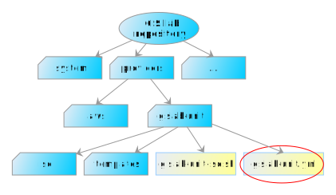
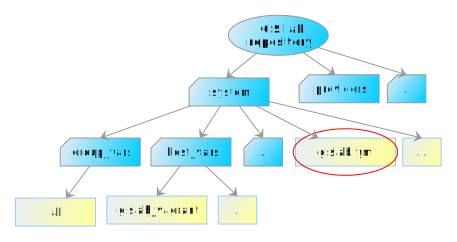
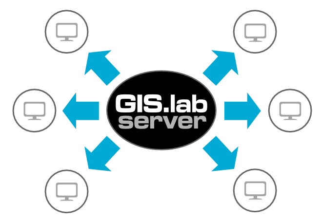
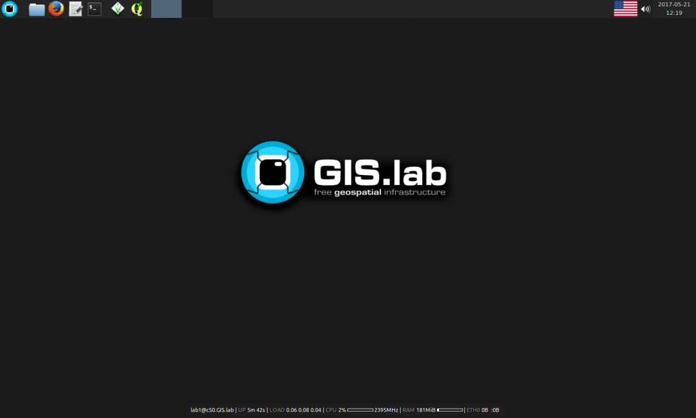

*************
Physical Mode
*************

.. _requirements-physical:

To run GIS.lab in physical mode, there are some hardware and software requirements. 
As well as using virtual mode, :ref:`GIS.lab source code <GL-clone>` is needed. 
Information about requirements can be found below together with graphical 
figuration, see :numref:`requirementsphysical`. 

*Hardware*

- GIS.lab Unit machine 

  - Intel NUC
  - at least 8GB RAM
  - SSD, 60-480GB

- at least 4 GB RAM on host machine

- networking accessories

  -  1 Gb Ethernet switch
  -  ethernet cables

*Software*

-  host machine running Linux or MAC OSX
-  Git, see :ref:`Git installation <git-installation>`
-  Ansible 2.0 or higher, see :ref:`Ansible installation <ansible-installation>`

.. _requirementsphysical:

.. figure:: ../img/installation/requirements-physical.svg
   :align: center
   :width: 750

   Requirements for installation in physical mode.

.. seealso:: |see| `Intel documentation
   <http://www.intel.com/support/motherboards/desktop/sb/CS-034249.htm>`_
   and `Intel documentation for NUC hardware
   <http://www.intel.com/support/motherboards/desktop/sb/CS-034031.htm>`_.

.. important:: |imp| In following procedure it is assumed that GIS.lab unit 
   machine is going to be installed in network with automatic IP address 
   assigning from :ref:`DHCP server <dhcp-server>`.

======
Master
======

The process of installation consists of three main steps:

1. :ref:`Adjusted operating system installation <basic-os>`
2. :ref:`GIS.lab initialization <initialization>`
3. :ref:`GIS.lab unit installation <unit-installation>`

.. _basic-os:

.. rubric:: Adjusted operating system installation

Following steps will guide user to install basic Ubuntu operating
system on GIS.lab unit machine. Network is configured to
automatically obtain :ref:`IP address <ip-address>` from :ref:`DHCP
server <dhcp-server>`.

In the first step download latest `64-bit PC (AMD64) Server Install
<http://releases.ubuntu.com/xenial>`_ type of **ISO image**
(ie. ``ubuntu-16.04.X-server-amd64.iso`` file).

.. _generate-ssh:

Furthermore, it is important to create **SSH keypair**. Generated
public part of keypair will be used as a way to identify trusted
computers without involving passwords. It can be generated on host
machine with ``ssh-keygen`` command. By default, the keypair will be
saved in ``$HOME/.ssh`` directory. It is recommended to rename new key
suitably, for example ``id_rsa_gislab_unit``.

Then use script ``providers/gislab-unit/gislab-unit-iso.sh`` from
:ref:`GIS.lab source code directory <GL-clone>` to create custom
**GIS.lab unit** installation **ISO image file** from original Ubuntu
server ISO image file downloaded in above step. Adjusted image will be
used for automatic installation of basic Ubuntu operating system on
GIS.lab unit machine.

.. tip:: |tip| Run ``./providers/gislab-unit/gislab-unit-iso.sh -h``
   command to see details of required options. Options are written below. 

.. code:: sh

   USAGE: gislab-unit-iso.sh [OPTIONS]
   Create GIS.lab base system installation ISO image from Ubuntu Server ISO.
   Script must be executed with superuser privileges.

   OPTIONS
    -s country code used for choosing closest repository mirror (e.g. SK)
    -t timezone (e.g. Europe/Bratislava)
    -d disk size in GB (valid options: 60, 120, 240, 480; default: 60)
    -a swap size in GB (default: 4)
    -k SSH public key file, which will be used for GIS.lab installation or update
    -w working directory with enough disk space (2.5 x larger than ISO image size)
    -i Ubuntu Server installation ISO image file
    -h display this help

For example, assuming that downloaded original Ubuntu server
installation ISO image is located in :file:`Downloads` directory, user
wants to use ``Italian`` official archive mirror, ``Rome`` timezone,
SSH public key file particularly created for GIS.lab installation is
located in :file:`.ssh` directory and new adjusted image should be
saved in :file:`tmp` directory, then the script can be run as follows.

.. code:: sh

   sudo ./providers/gislab-unit/gislab-unit-iso.sh -s IT -t Europe/Rome \
   -k ~/.ssh/id_rsa_gislab_unit.pub -w /tmp \
   -i ~/Downloads/ubuntu-16.04.2-server-amd64.iso

.. important::

   |imp| The ``gislab-unit-iso.sh`` script must be run with superuser
   (``sudo``) privileges. The script also assumes that 60GB SSD disk
   is available on GIS.lab unit machine. Different disk size can be
   prompted by ``-d`` option. Currently 60, 120, 240, and 480 GB SSD
   disks are supported.

.. _installation-iso:

   Creation of custom GIS.lab unit installation ISO image.

Continue with preparation of bootable installation USB stick from
custom GIS.lab Unit ISO image file created in previous step. On Ubuntu
`Startup Disk Creator
<https://en.wikipedia.org/wiki/Startup_Disk_Creator>`_ or `UNetbootin
<https://en.wikipedia.org/wiki/UNetbootin>`_ applications can be used.
**Recommended procedure** is based of ``dd`` command.  See example
bellow.

.. code-block:: sh
   
   sudo mkdosfs -n 'GIS.lab Base System' -I /dev/sdf -F 32
   isohybrid /path/to/your/gislab.iso
   sudo dd if=/path/to/your/gislab.iso of=/dev/sdf bs=4k
   sudo eject /dev/sdf

.. important::

   |imp| In example above is assumed that USB stick has been connected
   to host machine as ``/dev/sdf`` device. Your configuration **can be
   different**, please check connected devices by ``dmesg`` command!
   Note that formatting can be also done by ``gparted`` GUI
   application. For ``isohybrid`` command ``syslinux`` or
   ``syslinux-utils`` package must be installed.
      
When above process is done, together with ready USB stick attach also
power supply, HDMI display, keyboard and Ethernet cable into GIS.lab
unit machine, see :numref:`installation-unit`. Power it on, press
``F10`` key to run boot manager and select ``Boot from USB``
option. Then fully automatic installation should start. When finished,
machine will be turned off. USB stick should then be removed.

.. _installation-unit:

.. figure:: ../img/installation/installation-unit.svg
   :align: center
   :width: 450

   Necessary hardware components in adjusted operating system installation 
   process.

.. note:: |note| In installation process there is only one
   notification related to **cached packages** that allows to use Apt
   Cache server. Otherwise just ``Continue`` option should be
   selected.

As a next step, power on GIS.lab unit. In the case that monitor and
keyboard is connected to the unit it is possible to log in to machine
using username ``ubuntu`` and password ``ubuntu``. It is also possible
to log in to unit from host machine using SSH. That is why SSH key
:ref:`was generated <generate-ssh>`.

.. important:: |imp| GIS.lab unit has to be registered in the
   network. In other words `IP address` has to be assigned to
   unit. Run ``ip a`` command on the unit to detect this address.

In case unit is not registered automatically, run DHCP client that
apply for IP address. Then verify working internet connection,
e.g. with ``ping`` command.

.. code:: sh

   sudo dhclient eth0 -v
   ping 8.8.8.8

.. tip:: |tip| To restart network use ``sudo /etc/init.d/networking restart``
   command.

To log in on GIS.lab unit machine via SSH enter on host machine ``ssh
ubuntu@<ip addr>``

.. note:: |note| Instead of IP address also assigned ``name`` of
   registered unit should work, for example
   ``gislab.intra.ismaa.it``. This name can be found in output of
   ``nslookup <ip address>`` command.

   .. code:: sh

      $ ssh gislab@server.intra.ismaa.it -i ~/.ssh/id_rsa_gislab_unit.pub

.. _initialization:

.. rubric:: GIS.lab unit initialization

With regards to the recommended initialization, there are two
important Ansible files, :file:`<name-of-gislab-unit>.inventory` file and
configuration file in :file:`host_vars` directory which has already
been stated in :ref:`configuration section <configuration-section>` of
this documentation.

.. _ansible-inventory-file:

Let's create Ansible inventory file. The name depends on unit's name
which is the same as customization file in :file:`host_vars`
directory. The inventory file contains information about:

* name of GIS.lab unit
* IP address or hostname of unit
* the name of provisioning user able to log in to GIS.lab unit (always
  keep ``ubuntu``)

.. code-block:: sh
      
   <name-of-gislab-unit> ansible_ssh_host=<host-url> ansible_ssh_user=<provisioning-user-account-name>

Content of Ansible inventory file called ``gislab-unit-fem.inventory``
could be as follows.
 
.. code-block:: sh

   gislab-unit-fem ansible_ssh_host=10.234.1.44 ansible_ssh_user=ubuntu

In the next phase provisioning will be performed by
``ansible-playbook`` commands. For more detailed information about
playbooks, see `Ansible playbooks
<http://docs.ansible.com/ansible/playbooks.html>`_ manual page.
Example with above mentioned names and files is below. 

.. _gislab-unit-yml:

   Placement of important file for initialization in GIS.lab source
   code layout.

The initialization of GIS.lab unit will be performed by following
command run from host machine:
   
.. code:: sh

   ansible-playbook --inventory=gislab-unit-fem.inventory --private-key=~/.ssh/id_rsa_gislab_unit providers/gislab-unit/gislab-unit.yml

.. important:: |imp| It's important to use private SSH key from the
          same keypair as used when creating customized ISO image for
          unit installation. In example above is assumed that the
          command is run from GIS.lab source code directory where is
          also placed previously created inventory file.
             
GIS.lab unit will reboot when finished.

.. tip:: |tip| See ``gislab-unit.yml`` contect to be well aware of what this 
   script is exactly performing.

.. note:: |note| The initialization process depends on
   platform. Currently GIS.lab supports also `AWS
   <https://aws.amazon.com/>`__, see :file:`providers`
   directory.

.. _unit-installation: 

.. rubric:: GIS.lab unit installation

Once GIS.lab is configured, installation can be performed. Run
following command to execute another ``ansible-playbook``. In this
step all the work is made by :file:`gislab.yml` file located in
:file:`system` directory.

.. _gislab-yml:

   Placement of important file for installation in GIS.lab file layout.

.. code:: sh

   $ ansible-playbook --inventory=gislab-unit-fem.inventory --private-key=~/.ssh/id_rsa_gislab_unit system/gislab.yml 

Now, GIS.lab unit machine is installed with GIS.lab system. Do not
forget to :ref:`create user accounts <user-creation>` by
``gislab-adduser`` command and :ref:`allow client machines
<client-enabling>` to connect by running ``gislab-machines``
command.

======
Client
======

GIS.lab machines are initialized from GIS.lab network using PXE or HTTP. 
This means always clean system, maintenance free with no HDD required 
using full hardware potential what make it opposite to thin client.

.. _gislab-machines:

   GIS.lab machines launching.

Physical client mode is preferred way of launching GIS.lab client,
because it provides best performance. It will run GIS.lab client session
on client machine instead of original operating system installed (if
any) on hard drive. Original operating system and local data will stay
**untouched** and will be ready to run again after GIS.lab client is shut down.

To run physical client, it is required to connect machine running
GIS.lab server and client machines via **Gigabit switch and cables**, CAT 5e
or higher.

There is no reason to be afraid of loosing domestic operating system.
GIS.lab client is capable to run even if you have Windows, Linux or
MAC OSX installed on cliet machine.

Complete process of running GIS.lab client using physical mode, i.e. GIS.lab
unit consists of three main steps.

1. :ref:`Booting <booting-physical>`
2. :ref:`Enabling GIS.lab client on GIS.lab server <client-enabling>`
3. :ref:`Running physical GIS.lab client <client-running-physical>`

.. _schema-physical-client:

.. figure:: ../img/installation/schema-physical-client.png
   :align: center
   :width: 450

   Any computer can be GIS.lab client.

.. _booting-physical:

.. rubric:: Booting

As well as in :ref:`virtual mode <booting-virtual>` it is possible to boot 
using using :ref:`PXE <pxe-boot-physical>` or :ref:`HTTP <http-boot-physical>` 
boot.

.. important:: |imp| Client machine must be enabled on master, see
   :ref:`client-enabling` section for details.

.. _pxe-boot-physical:

^^^^^^^^
PXE boot
^^^^^^^^

PXE is a method of having a client boot using only its network card. 
Using this method of booting it is possible to circumvent the normal boot 
procedure, what means booting from CD/DVD/CD-RW Drive to 
**Network Interface Card**, usually known as **NIC**.

PXE boot is a default boot mode for GIS.lab clients. Booting from PXE
requires to instruct client machine to boot from other device as it is
usually doing so. On newer computers it is also required to 
disable **Secure** boot and/or enable **Legacy** mode.

.. important:: |imp| It is necessary to enabling NIC in BIOS. 

The way how to enabling NIC is going into BIOS and look for it.  It
depends on machine. BIOS boot order can be changed for one time using
``F9`` or ``F12`` key, for permanent setup from BIOS configuration
using ``DEL``, ``F2`` or ``F12``, but it can differ from one to
another machine brand.

It is recommended to look for *Preferal devices*, *System
Configuration*, *Integrated Devices* or something similar and find
**NIC** card there.  When it is found, **enabled** and then back out,
save and reboot should be selected.

In general, there are multiple possibilities how to instruct client machine to 
boot from PXE. See potential instructions below.

A. Depending on vendor, pressing some ``F`` at machine start will 
   temporary instruct machine to boot from PXE. 

B. Depending on vendor, pressing some ``F`` key at machine starts to launch boot 
   manager and enables to choose ``PXE`` or ``PCI LAN`` in boot menu to 
   boot from PXE. 

C. ``PXE`` or ``LAN`` option set as first boot device in BIOS configuration 
   enable to boot from PXE after machine restart.

.. seealso:: |see| See procedure of enabling PXE boot for 
   :ref:`Lenovo <pxe-boot-lenovo>` or :ref:`Dell <pxe-boot-dell>` machine in 
   :ref:`GIS.lab in practice <practice>` section.

   For more information about how it works see for example `PXE Boot
   Server Installation Steps in Ubuntu Server VM
   <http://askubuntu.com/questions/412574/pxe-boot-server-installation-steps-in-ubuntu-server-vm/414813>`__.

.. _http-boot-physical:

^^^^^^^^^
HTTP boot
^^^^^^^^^

In addition to default PXE boot method, GIS.lab clients can boot over
HTTP, which can provide some advantages. 

To enable HTTP boot, it is needed to create **bootable USB stick**
from special **ISO image** which exists in :file:`http-boot` directory.
Recipe is as follows.

Insert free USB stick into Linux workstation machine. If it is
automatically mounted, unmount it. Run ``dmesg`` command to detect
device assigned to USB stick by operating system. 

.. note:: |note| It should be something like ``/dev/sd[x]``.

Burn GIS.lab Desktop bootloader into USB stick with command below. Be careful 
to choose correct output device without a partition number.

.. code:: sh

   $ sudo dd if=http-boot/gislab-bootloader.iso of=/dev/sd[x]

Insert prepared USB stick into client machine and instruct it to boot
from it.

.. _client-running-physical:

.. rubric:: Running physical GIS.lab client

After successful booting, there will be welcome screen with login dialog, see 
figure :numref:`login-unit`. Creation of user accounts and running GIS.lab clients are 
the same as in virtual mode. Find more details in 
:ref:`User accounts <user-creation>` and 
:ref:`Running virtual GIS.lab client <client-running-virtual>` sections. 

.. _login-unit:

.. figure:: ../img/installation/login-unit.png
   :align: center
   :width: 450

   GIS.lab client logging in.

Enjoy!

.. _running-client-unit:

   GIS.lab client running environment.

.. _gislab-upgrade:

===============================
How to upgrade GIS.lab Desktop?
===============================

GIS.lab upgrade procedure consists from three steps described in
:ref:`virtual mode <gislab-upgrade-virtual>` section. Only difference
is command used for upgrade, Ansible is used instead of Vagrant.

GIS.lab source code update: 

.. code-block:: sh

   $ git pull

Upgrade with Ansible:

.. code-block:: sh

   $ ansible-playbook --inventory=gislab-unit.inventory --private-key=<private-SSH-key-file> system/gislab.yml
