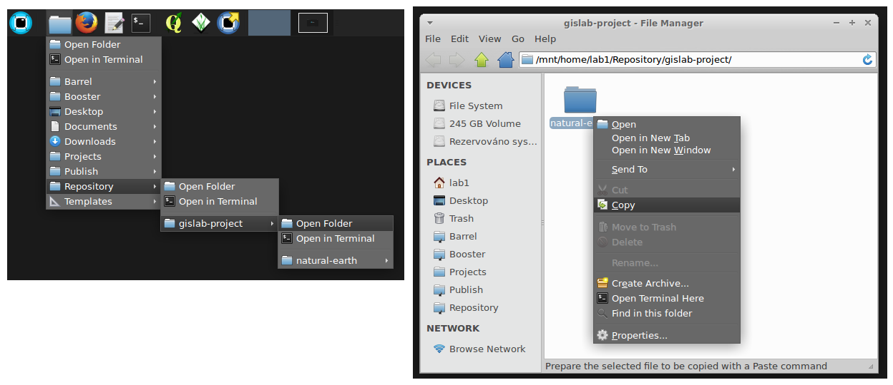
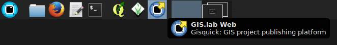

==============================
GIS project publication on Web
==============================

GIS projects are created and managed by **QGIS** application, which is
a main tool for geospatial tasks in GIS.lab environment. QGIS is
accessible under :menuselection:`GIS.lab --> GIS.lab Desktop` item in
GIS.lab applications menu.

Due to integrated **Gisquick** (http://gisquick.org) it is possible to
publish GIS projects created in Desktop to Web environment just *in few
steps*.

In following steps simplest possible GIS project will be created and
published on Web.

1. **Log in to GIS.lab desktop client session**

Use login and password for user account that has been created by
``gislab-adduser`` command on GIS.lab master node (see
:ref:`user-creation` section for details).

2. **Copy sample GIS project**

Copy sample GIS project
(:file:`Repository/gislab-project/natural-earth`) to your
:file:`Projects` folder.

   
   Copy sample Natural Earth sample GIS.lab project.

           
   Paste sample project to :file:`Projects` directory.

3. **Open GIS project**

Select :file:`central-europe.qgs` project file and open by *QGIS*
application.

   Open sample GIS.lab project.

Feel free to modify sample project based on your needs.

   
   Modify GIS.lab project for your needs.

Now the first GIS project is ready.

.. _practice-gislab-web-publishing:

4. **Publish project on web**

Open **Gisquick plugin**, and follow publishing wizard.

.. figure:: ../img/practice/gislab-web-4.svg
   
   Launch Gisquick plugin to start publication process. Define
   basemaps, layers, and project metadata.

           
   Define topics.

           
   Check configuration summary.

Now publish project by pressing ``Publish`` button. Publishing
target is automatically set on GIS.lab to :file:`Publish/user`
directory. There is no need to change any settings or create zip file.
   

           
   Publish project by simply pressing ``Publish`` button.
      

Launch **Gisquick** as :menuselection:`GIS.lab --> GIS.lab Web`
applications menu from main GIS.lab panel.

           
   Launch Gisquick from main panel.

Log in with user's credentials.

           
   Log in by user's credentials.

           
   Continue to enter Gisquick web environment.
   
Then inspect published project which should be listed.

           
   Click on project's link in URL column to launch project in Gisquick.

Click on project's link in URL column to launch project in web
environment.

           
   Enjoy first published GIS.lab project in web environment.

For more investigation about Gisquick download more complex `Prague
sample project
<http://gisquick.readthedocs.io/en/latest/user-manual/datasets.html#dataset-prague>`__
and study `Gisquick documentation
<http://gisquick.readthedocs.io/en/latest/>`__.
